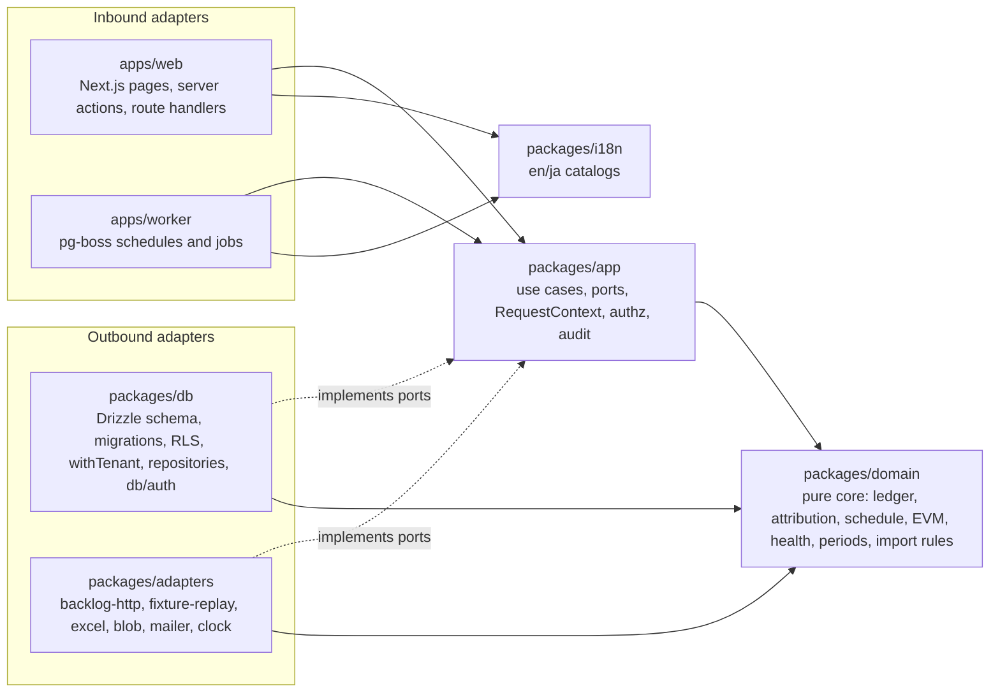
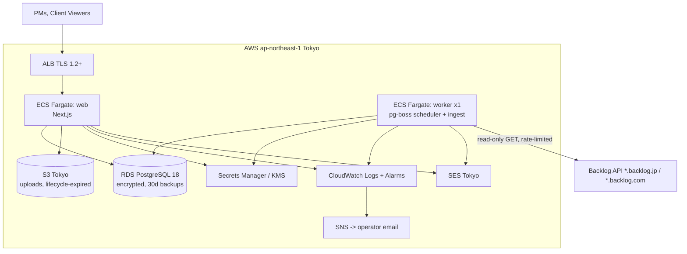
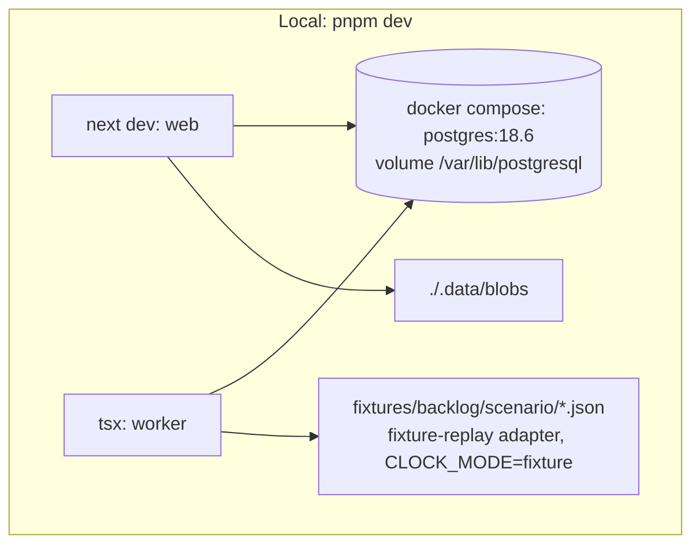
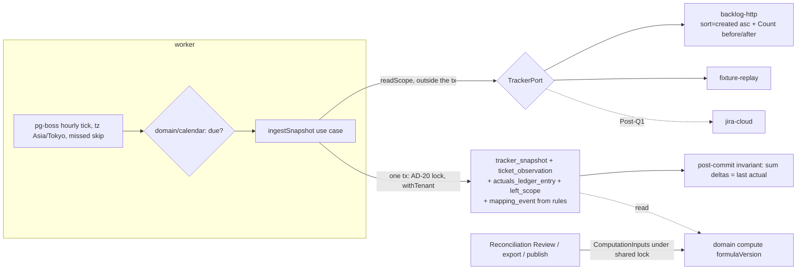
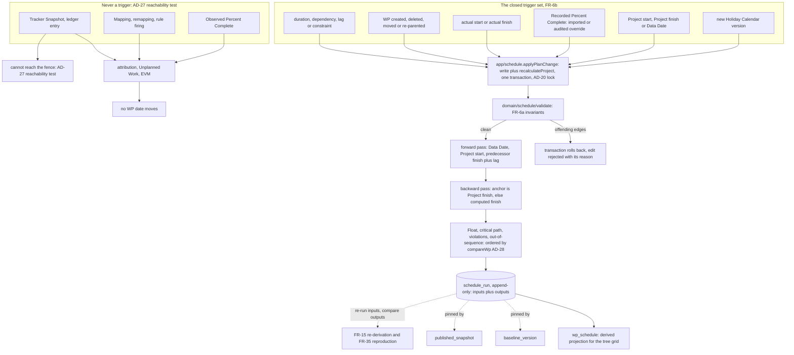

# Architecture Spine: momo-keikaku

**Against PRD §7.3, this update sits in the left-hand column: it resolves OQ-13 and decomposes FR-6a, FR-6b and FR-43. It adds no FR, no NFR and no target beyond PRD §5.**

This spine was produced headless, overnight, and then amended to apply the findings of four reviews (rubric, adversarial, reconcile-inputs, tech-currency); the resolution trail is in `reviews/resolution.md`. On 2026-09-20 it was updated with the founder present to carry the scheduler that `sprint-change-proposal-2026-09-20.md` restored to R0 — AD-25 through AD-30, with earlier decisions amended in place and their IDs unchanged. Every call tagged `[ASSUMPTION]` was made on the founder's behalf and is waiting for review. On 2026-09-21 AD-1 gained a second carve-out, `apps/web`'s composition root (story 1.2 slice 3), reviewed adversarially before it landed (`reviews/review-adversarial-ad1-carve-out.md`); the same day, once story 1.2 slice 4 had moved the writes, AD-1's temporary-violations bullet was replaced by what the `dependency-cruiser` gate actually enforces (`reviews/review-adversarial-ad1-gate-on.md`). Vocabulary follows PRD §3. Code names use the Glossary terms verbatim (for example `WorkPackage`, `TrackerSnapshot`, `ActualsLedgerEntry`, `PublishedSnapshot`).

## Design Paradigm

**Modular monolith, hexagonal (ports & adapters), with a pure functional core.** [ASSUMPTION]

- **One TypeScript codebase and one PostgreSQL database.** The codebase runs as two roles: `web` (Next.js) and `worker` (the always-on snapshot scheduler and job runner).
- **Functional core** (`packages/domain`): ledger derivation, attribution, Reporting Periods, calendars, **schedule recalculation**, EVM, Health, forecast and import interpretation. Every function is pure (inputs → outputs), does no I/O and never reads the clock.
- **Application layer** (`packages/app`): use cases, the port interfaces, `RequestContext`, authorisation and audit. It orchestrates each call: load inputs through ports, call the core, persist through ports.
- **Adapters** (`packages/db`, `packages/adapters`, `apps/web`, `apps/worker`): Postgres/Drizzle, the Backlog HTTP client, fixture replay, Excel, blob storage, mail, the clock, and the inbound HTTP/UI and job entry points.
- **Shared leaves** (`packages/i18n`): message catalogs, imported by both roles. It depends on nothing.



Arrows show allowed imports, plus AD-1's two carve-outs. Nothing imports `apps/*`. `domain` and `i18n` import nothing from the workspace.

## Invariants & Rules

### AD-1: Dependency direction is enforced mechanically

- **Binds:** all
- **Prevents:** metric code that quietly reads the DB or the clock, making Published Snapshots non-reproducible; UI code that bypasses authorisation by querying tables directly.
- **Rule:**
  - The import graph is exactly the one in the diagram above plus the two carve-outs below, and `dependency-cruiser` fails CI on any violation. `packages/domain` has no runtime dependencies except `zod`. `apps/web` and `apps/worker` call only `packages/app` use cases (and `packages/i18n` for text), never repositories or Drizzle directly, except through the carve-outs below.
  - `Date.now()`, `new Date()` without arguments and `process.env` are forbidden outside `packages/adapters/clock` and `packages/app/config`. dependency-cruiser cannot see calls, so this is enforced by ESLint `no-restricted-syntax` (`NewExpression[callee.name='Date'][arguments.length=0]`, `CallExpression[callee.object.name='Date'][callee.property.name='now']`) and `no-restricted-properties` for `process.env`, with file-scoped overrides for the two allowed modules.
  - **Two carve-outs, each a named path rather than a pattern.** (1) `packages/db/auth` is the only sanctioned Better Auth ↔ Drizzle binding, exported to `apps/web` as an adapter that implements `IdentityPort` (AD-23). Role, membership and revocation changes never go through it; they go through `app` use cases so AD-14 still holds. (2) `apps/web/src/server/composition.ts`, `apps/web`'s **composition root**, is the one file in `apps/web` permitted to import `packages/db` (by any specifier). It builds the restricted-role handle, hands `packages/db`'s repository functions to the port(s) `packages/app` declares (a structural match TypeScript checks at that line) and constructs the use-case context. It wires; it never queries, and it exports use-case bindings only — never a `Db` handle, a repository function or a Drizzle schema to another file in the app. It never imports `db/repositories/schedule` or `db/repositories/plan-input` (AD-27). Any other app that needs a composition root names its file here first; `apps/worker` has none. Added 2026-09-21 by story 1.2 slice 3.
  - **What the `dependency-cruiser` gate enforces today** (`.dependency-cruiser.cjs`, `pnpm depcruise`; switched on by story 1.2 slice 4, after `actions.ts`'s writes moved onto use cases). It cruises `apps/` and `packages/` only, and it turns CI red but does not block a merge: branch protection is unavailable on the private free-plan repository, so every CI gate reports rather than blocks (decided 2026-09-20, recorded in the CI header). Within that scope it fails on:
    - any `apps/*` file importing Drizzle — the composition root included;
    - any `apps/web` file other than the composition root importing `packages/db`, except `packages/db/auth`; and any other app importing `packages/db` at all, `packages/db/auth` included;
    - the two scheduling edges below, and the composition root importing the schedule or plan-input repositories. These match no file yet (none of the three paths exists) and were proved live with temporary files; the two repositories may import each other;
    - an import it cannot resolve, so a broken resolver setup fails instead of letting an edge escape every rule.
  - **What it does not enforce yet**, so the first bullet's "fails CI on any violation" holds only for the edges above. Each is tracked in `deferred-work.md`:
    - *Live violations, added to the gate when the code is gone:* `apps/worker` imports `pg-boss` and `pg` directly; and eight `apps/web` files import `packages/domain` directly — presentation helpers (`hours`, `hoursSigned`, `share`, `yen`, `present`, the `Metric` type) and domain logic (`clientProjection`, `DEFAULT_VISIBILITY`, `mappingHead`) — an edge the diagram does not draw — **whether to forbid it or add the arrow is an open decision**, and its rule lands with whichever fix is chosen.
    - *Nothing to flag today, unenforced by scope choice, added with the next change to the config:* `apps/web` importing the raw `pg` driver; `packages/db` and `packages/app` importing each other; `packages/domain` importing anything but `zod`; every other edge of the diagram; and nothing outside `tests/` importing from it.
    - *Not an import rule at all:* the composition root exporting use-case bindings only and never querying. A re-export from `packages/db` is an edge of `composition.ts` itself, so the gate cannot see it; `tests/web-composition.test.ts` pins its wiring, and review holds the rest.
    - `scripts/` (seed, policy generation, pg-boss migration) is operator tooling outside this graph, like `tests/`.
  - `tests/` sits outside this graph. The cross-tenant harness there wires `packages/app` to `packages/db` because it must drive both at once (AD-3); that is test-only wiring, not a carve-out. Nothing outside `tests/` imports from it.
  - Message catalogs live in `packages/i18n/{en,ja}.json`, not under `apps/web`, so the worker can render mail (FR-17, FR-36) without importing an app.
  - **Two scheduling edges are forbidden outright** (AD-25, AD-27): `domain/schedule` may not import `domain/attribution`, so nothing derived from Tracker evidence can become a scheduling input by accident; and `db/repositories/schedule` and `db/repositories/plan-input` may not be imported outside `packages/app/schedule` (AD-27), so the scheduler stays the only writer of derived dates and every input write goes through its fence.

### AD-2: One runtime topology: web + worker + Postgres, with no other stateful service

- **Binds:** all; NFR-R1, NFR-S4
- **Prevents:** a Redis, a queue or a second datastore creeping in, so that local and production environments differ and the solo operator has more to run.
- **Rule:** Jobs, schedules and retries use `pg-boss` on the application Postgres. Sessions live in Postgres (Better Auth). The only stateful dependencies are Postgres and a `BlobStore` port (local filesystem in dev, S3 Tokyo in production). Both roles ship in one container image and differ only by their start command. [ASSUMPTION]

### AD-3: Tenant isolation lives in the data layer (RLS) and nowhere else is trusted

- **Binds:** FR-1, FR-2, NFR-S1, NFR-S7, NFR-D1
- **Prevents:** one repository filtering by `tenant_id` while another forgets to; a cross-tenant leak that a single missed `WHERE` clause would cause.
- **Rule:**
  - Every tenant-owned table has `tenant_id uuid NOT NULL`. Every foreign key between tenant-owned tables is composite and includes `tenant_id`.
  - Every tenant-owned table has `ENABLE` and `FORCE ROW LEVEL SECURITY`, with a policy of `tenant_id = NULLIF(current_setting('app.tenant_id', true), '')::uuid`. Using `NULLIF` with the missing-ok form means an unset variable yields no rows rather than error 42704.
  - Drizzle 0.45's `pgPolicy`/`enableRLS` do not emit `FORCE ROW LEVEL SECURITY`, so FORCE lives in `packages/db/rls.sql`. CI asserts `pg_class.relforcerowsecurity` is true for every table carrying `tenant_id`, and that every such table has a policy.
  - The application connects as a non-owner role without `BYPASSRLS`. All tenant data access goes through `withTenant(tenantId, tx => …)`, which opens a transaction and runs `select set_config('app.tenant_id', $1, true)` with a **bound** uuid. `SET LOCAL app.tenant_id = $1` is not parameterizable in Postgres and is banned; string interpolation into `SET` is an injection foot-gun.
  - `set_config(..., true)` is transaction-scoped, which is safe with a `pg` Pool provided every query runs inside the `withTenant` transaction. A lint rule and a test ban the bare `db` handle on any tenant-owned table.
  - Work that spans Tenants (the worker's schedule fan-out, operator metrics) uses a separate `system` path. That path may read only tables of class `global` or `operational` in the AD-21 registry, and then enters `withTenant` for each Tenant. It may not be extended ad hoc: adding a table to that set is a change to the registry.
  - Every pg-boss job payload carries `tenant_id`, and every handler re-verifies inside `withTenant(tenant_id)` that its target row (for example the Connector) exists before acting. A payload is untrusted input, validated by zod like any other boundary.
  - A shared test harness seeds two Tenants and asserts, for every read use case, that nothing from the other Tenant comes back (FR-1). [ASSUMPTION]

### AD-4: Numbers are exact integers until presentation

- **Binds:** FR-6b, FR-12, FR-25, FR-30, FR-31, FR-35, FR-39
- **Prevents:** floating-point drift that makes a recomputed Published Snapshot differ from the one stored (FR-35); two modules rounding differently; a threshold compared against a rounded value in one module and an exact one in another.
- **Rule:**
  - Effort is stored and summed as integer **milli-hours** (`bigint`; 1 h = 1000). Ticket counts are integers.
  - Money is integer **JPY**. The Tenant currency is fixed to JPY (FR-4).
  - Hours × Rate is computed as `round_half_even(milliHours × yenPerHour / 1000)` for each ledger entry, then summed.
  - **Ratios are never floats.** CPI, SPI, TCPI and every share are `Ratio = { num: bigint, den: bigint }` inside `domain`, carried unreduced except by an explicit `reduce()`.
  - **Threshold comparisons use the exact value, never the rounded one**, by cross-multiplication: `spi ≥ 0.95` is `num × 100 ≥ den × 95`. A single `compareRatio(ratio, { num, den })` in `domain/health` is the only comparison site, so 0.9496 can never be green in one module and amber in another.
  - **Fractional spreads** (PV per working day across a WP's Baseline window, a BAC split across Resources) are allocated in integer milli-hours by **largest remainder**, with ties broken deterministically by (date ascending), then (resource id ascending). No module divides and rounds independently.
  - Rounding happens only in `packages/domain/present`: ratios to 2 decimals, hours to 1 decimal, yen to integer. That module is the only rounding site for both the UI and Published Snapshot outputs. [ASSUMPTION]
  - **The schedule obeys the same discipline.** Durations, lags and Float are whole working days as integers; there is no partial day anywhere. Remaining duration is `ceil(duration_days × (1 − recorded_pct))` clamped to at least 1, evaluated as integer arithmetic over the `Ratio` form of the Recorded Percent Complete so it cannot drift between two recomputations (FR-6b, AD-27).
  - **Serialisation:** `JSON.stringify` throws on `bigint`, so every `jsonb` write and read of stored outputs and inputs goes through one codec in `packages/domain/present/codec`, which renders `bigint` as a decimal **string** and `Ratio` as `{ num: string, den: string }`. The reproduction test compares through the same codec, so equality is exact. **`jsonb` does not preserve stored bytes** — it reorders object keys and renormalises numbers — so every "identical" in this spine means identical in the codec's canonical decoded form, never identical column text. A test that diffs `jsonb` text will flake.

### AD-5: Append-only stores are enforced by the database

- **Binds:** FR-12, FR-15, FR-16, FR-19, FR-21, FR-22, FR-25, FR-35, FR-39, FR-42, NFR-A1, NFR-D1
- **Prevents:** a "quick fix" UPDATE on a ledger row that silently changes history and every past figure; a maintenance job quietly deleting the inputs a Published Snapshot pins.
- **Rule:**
  - These tables are insert-only: `baseline_version`, `baseline_wp`, `tracker_snapshot`, `ticket_observation`, `actuals_ledger_entry`, `mapping_event`, `rate_entry`, `project_default_rate_entry`, `tenant_setting_event`, `project_setting_event`, `wp_status_event`, `wp_flag_event`, `calendar_day_event`, `holiday_calendar_version`, `schedule_run`, `tracker_account_link_event`, `connector_scope_event`, `connector_setting_event`, `measurement_basis_event`, `connector_ownership_event`, `visibility_policy_event`, `pct_override_event`, `disposition_event`, `audit_log` and `published_snapshot`. The full classification of every table is AD-21.
  - The application role has no `UPDATE`/`DELETE` grant on these tables, and a `BEFORE UPDATE OR DELETE` trigger raises an error.
  - **Two sanctioned exceptions, both through the `maintenance` role and nothing else:** the FR-19 compaction job and `purgeTenant` (NFR-D1, NFR-S6). The trigger allows a statement only when `current_setting('app.maintenance', true) = 'on'`, and only the `maintenance` role is granted the ability to set it. Both jobs write to a non-tenant `operator_audit` table.
  - **Compaction (FR-19) deletes only `ticket_observation` rows.** It never deletes a `tracker_snapshot` header row, so `actuals_ledger_entry.prev_snapshot_id` and `snapshot_id` keep their referents. It retains the observation set of any snapshot that is referenced by a `published_snapshot.inputs`, by any ledger entry, by an open Review, by an unexpired export, by the first snapshot of a Reporting Period, or that is the Connector's latest. FR-39 exports only the snapshots whose observations are retained, and says so on the export.
  - **`schedule_run` retention is by reference, not by count** (AD-26). A run's `inputs` may be deleted only when it is **older than the oldest run its Project still references** — from a `baseline_version`, a `published_snapshot`, an open Review or an unexpired export — and is not the latest. Counting the last N would delete exactly the runs in between two Reviews, which is the set FR-28 attributes date movement from and FR-16's "every date change is attributable" depends on. A run's `outputs` may be dropped earlier, whenever the run is neither pinned nor latest, because `outputs` is a pure function of `inputs`; `inputs` and the `causes` array are never dropped while the run is retained.
  - A CI test runs compaction over the golden corpus and then recomputes every golden Published Snapshot, asserting byte-identical output through the AD-4 codec.
  - Corrections are new rows. Current state is the latest row by `seq` **at or below the pinned watermark**, and watermark validity is AD-20.
  - The only mutable planning state is the Current Plan's **inputs** — `work_package` names, parentage, effort, duration, constraint, actual dates, custom field definitions and values, and the `wp_dependency` edges — along with configuration tables such as `connector`, `mapping_rule` and `tracker_account`. **Derived dates are not in that set and are not columns on `work_package` at all** (AD-25). Every change to those is mirrored into `audit_log`. Any attribute of a WP that a domain function reads is **not** mutable state; it is an event (AD-21).
  - Each append-only table has a `seq bigint` (identity) used as a high-water mark under the discipline in AD-20.

### AD-6: Trackers are reached only through `TrackerPort`, and adapters are swappable per Connector

- **Binds:** FR-17, FR-18, FR-19, FR-22, FR-42; the local demo
- **Prevents:** Backlog-specific shapes leaking into the ledger, which would block Jira and fixture replay; the demo needing real Backlog credentials; a paginated read reporting `complete` when it silently skipped Tickets.
- **Rule:**
  - `TrackerPort.readScope(connectorConfig, credentials) → { complete: boolean, observedAt, tickets: TicketObservation[], accounts: TrackerAccountObservation[], hoursFieldPresent, rateLimit, adapterKind }`.
  - A `TicketObservation` holds only the FR-19 whitelist: `trackerIssueId` (internal id), `key`, `title`, `statusId`, `estimateMh | null`, `actualMh | null`, `assigneeAccountId | null`, `createdAt`, `parentIssueId`, `issueTypeId`, `trackerProjectId`, and `attributes: { kind, id, label? }[]`. Raw payloads, descriptions and comments are never persisted.
    - `createdAt` is required by the Opening Balance rule in AD-7.
    - `attributes` replaces the Backlog-shaped `milestoneIds[]` / `categoryIds[]`, with a closed `kind` enum per Tracker (Backlog: `milestone`, `category`; Jira Post-Q1: `label`, `component`, `fixVersion`, `epic`). Mapping Rules (FR-22) read `attributes`, so adding Jira never migrates the ledger or the rule schema.
    - **The adapter does not decide "Resolved".** It reports `statusId` only. The Resolved status set is Connector configuration held in `connector_setting_event` and resolved at compute time under a pinned seq (AD-10), because Percent Complete depends on it.
  - `TrackerAccountObservation { accountId, displayName, email? }` is the only source of `tracker_account` identity rows. Ingest upserts them; nothing else creates them. They carry the display name and email that FR-13 link suggestion needs, and they are personal data under NFR-S6, so they never reach operator logs (NFR-O1).
  - **Completeness of a paginated full read (Backlog):** Get Issue List defaults to `sort=updated&order=desc`, under which a Ticket updated mid-read jumps to page 1 and shifts every later page, so Tickets are skipped and duplicated while the read still looks finished. Therefore:
    - `backlog-http` reads with `sort=created&order=asc`, with the internal id as tiebreak, so existing positions are stable and new Tickets append at the end.
    - It calls Count Issues with the same filter before and after the read. The read is `complete` only if the union of pages has distinct ids with no duplicates **and** its size equals both counts. Otherwise it retries once and then records a failed attempt.
    - Get Issue List counts against Backlog's **Search** bucket, which is plan-dependent and lower than the Read bucket, and is shared across every integration using the same API user. At Connector setup the adapter calls Get Rate Limit and stores the Search limit. If one full read would consume more than 25% of the Search budget per interval, the Connector is refused at setup or its schedule is slowed, with an operator alert. [ASSUMPTION]
  - Implementations are `backlog-http` (R0), `fixture-replay` (dev, demo and tests) and `jira-cloud` (Post-Q1). The adapter is chosen by `connector.adapter` (`backlog | fixture | jira`), and `TRACKER_ADAPTER_OVERRIDE=fixture` forces fixture replay everywhere outside production.
  - **The adapter kind in effect is recorded on every `tracker_snapshot`.** `ingestSnapshot` refuses, with an operator alert, if it differs from that Connector's previous snapshot. Fixture Tickets carry `tracker_kind = 'fixture'`, so fixture and live identities can never collide and a toggled override cannot mass-`left_scope` a Connector's history (AD-24).
  - `fixture-replay` reads `fixtures/backlog/<scenario>/NNNN.json`: recorded Get Issue List pages plus an `observedAt`. The per-Connector cursor lives in a `packages/db`-owned table reached through a `FixtureCursorPort`, not inside the adapter, so no outbound adapter touches the DB directly (AD-1). Required scenarios: an hours scenario, a no-hours scenario (Ticket-Count Mode), "page shift" (a Ticket updated mid-read), "leave and return", and a scope-change scenario. [ASSUMPTION]
  - Adapters only read, and the HTTP adapter has no non-GET code path (FR-17).

### AD-7: One owner writes the Actuals Ledger: the snapshot ingest transaction

- **Binds:** FR-17, FR-19, FR-20, FR-25, FR-42, NFR-P1, NFR-R1
- **Prevents:** two code paths deriving deltas differently; double-counted Tickets; partial snapshots that corrupt deltas; a re-entering Ticket booked twice.
- **Rule:**
  - Only the `ingestSnapshot` use case (worker) inserts into `tracker_snapshot`, `ticket_observation` and `actuals_ledger_entry`.
  - The flow is: full-scope read → one DB transaction that (a) takes the per-Project lock of AD-20, (b) records the snapshot with its `adapter_kind`, `scope_seq` and optional `scope_change_id`, (c) upserts `ticket` and `tracker_account` identity, (d) appends one ledger entry per Ticket whose `actualMh` changed, (e) marks `left_scope`, and (f) re-evaluates Mapping Rules (AD-9). The transaction is idempotent on `(connector_id, observedAt)`.
  - **R0 reads the full scope on every snapshot:** about 20 Get Issue List calls per 2,000 Tickets, paced by the `X-RateLimit-*` headers and budgeted per AD-6. Incremental `updatedSince` reads are deferred; the guard that holds today is: *an incremental read may never mark `left_scope`, and a complete full read must run at least daily.*
  - `ingestSnapshot` refuses a Connector that has no `approval_recorded_at` (FR-17: client-side approval is recorded before the first Tracker Snapshot), and records the refusal as a failed attempt with a PM-visible reason.
  - A read that is not `complete` writes nothing and is recorded as a failed snapshot attempt (FR-19), visible to the PM.
  - **`left_scope` requires two consecutive complete reads** in which the Ticket is absent. One complete read alone is not enough, because completeness is a property of the adapter's own accounting and a single bad page costs a Ticket's whole history.
  - Ticket identity is `UNIQUE (tenant_id, tracker_kind, tracker_site, tracker_issue_id)`, with exactly one `owner_connector_id`. `ticket.project_id` is derived from the owning Connector and is the Project that its hours belong to (AD-9 uses it to keep Mappings inside one Project). When a second Connector sees an owned Ticket, the result is a `connector_overlap` record and not a ledger entry (FR-42).
  - **Ownership transfer** happens only through a PM-confirmed resolution of a `connector_overlap`, recorded as an append-only `connector_ownership_event`. The ledger stays on the Ticket; no Opening Balance is written; only `owner_connector_id` moves. An owner Connector being deleted or losing scope does not transfer ownership by itself.
  - **Entry kinds are `opening_balance | delta`:**
    - `opening_balance` is written in exactly two cases (FR-42): the Ticket is in the Connector's **first** snapshot; or the Ticket is first seen in the first snapshot after a recorded `connector_scope_event` **and** its `createdAt ≤ prev_snapshot.observed_at`. A Ticket created since the previous snapshot is a `delta`, even in that snapshot, because its hours are genuinely new.
    - Every other first sighting is a `delta` from 0.
    - **Re-entry after `left_scope` is a `delta` from the Ticket's last observed `actualMh`, never from 0 and never an `opening_balance`,** unless a recorded scope change made it an Opening Balance case above.
  - **Null hours never move the ledger.** `actualMh = null` produces no entry, and a transition from a value to `null` produces no negative delta; it sets `hours_cleared = true` on the observation. Only a numeric-to-numeric change produces a delta. This keeps a Ticket-Count Mode Connector, or a plan downgrade that removes the hours field (OQ-2), from zeroing out AC.
  - Each entry stores `prev_snapshot_id`, `snapshot_id`, `window_start`, `window_end = observedAt`, `delta_mh`, `assignee_account_id`, and `active_baseline_version_id`. **It does not store `resource_id`:** the Resource is resolved at query time from `tracker_account_link_event` (AD-9), so a late FR-13 link fixes past hours instead of leaving them Unattributed forever.
  - `active_baseline_version_id` is the latest `baseline_version` **by `seq`, committed before this transaction took its AD-20 lock** — never a timestamp comparison against `observedAt`. Timestamp comparison breaks under fixture replay (recorded times precede the seeded Baseline) and under a concurrent `rebaseline` spanning a paged read.
  - After commit, the check `Σ delta_mh per Ticket = last observed actualMh` runs, and a violation raises an operator alert (AD-19).
  - **Queue semantics:** the `ingest-snapshot` queue is *created* with `createQueue('ingest-snapshot', { policy: 'stately' })` and jobs are sent with `singletonKey = connectorId`. `singletonKey` alone on a `standard` queue only throttles per time slot and does **not** prevent two active jobs with the same key; `stately` gives one active plus one queued per key, so an on-demand request coalesces behind the running snapshot and the rest are dropped.
  - **Retries (NFR-R1):** `retryLimit: 3` with backoff sized so every attempt finishes inside one snapshot interval (under 45 minutes). Each failed attempt is a visible row, not just a log line.

### AD-8: Measurement basis is latched per Connector, and metric results are total

- **Binds:** FR-17, FR-27, FR-30, FR-31, FR-33; OQ-2
- **Prevents:** zeros shown where hours don't exist; hours and counts summed together; branching on the Backlog plan name; a Connector flipping basis week to week because one engineer logged 0.5 h.
- **Rule:**
  - The basis is a property of the **Connector**, recorded in an append-only `measurement_basis_event` and pinned in `ComputationInputs` as `basis_seq_max`. Each `tracker_snapshot` still stores its observed `measurement_basis` as evidence, but no metric reads it directly.
  - **Hysteresis:** the Connector switches to `hours` only after N = 3 consecutive complete snapshots in which `hoursFieldPresent` is true and at least one observation has a non-null `actualMh`. It switches back to `count` only after N = 3 consecutive complete snapshots with the hours field absent or empty on every Ticket. The basis is never derived from the plan name. [ASSUMPTION: N = 3]
  - A computation uses the Connector's latched basis at `basis_seq_max`.
  - Every metric function returns `{ kind: 'value', value, unit: 'mh' | 'jpy' | 'ratio' | 'count', coverage } | { kind: 'unavailable', reasonCode }`. The UI renders `unavailable` with its reason and never as 0.
  - Hours and counts are never combined in one sum. In a Project that has both kinds, AC-based metrics carry a `coverage` of the hours Connectors only (FR-27).
  - **Count mode has no ledger entries, so the Period Unplanned figure is defined explicitly (FR-27):** the Reporting Period's Unplanned count is *Tickets first observed in, or Resolved within, the Period whose Mapping at `mapping_seq_max` is Unplanned*. This is one function in `domain/attribution` used by the indicator and by the Review, so two modules cannot colour it differently. "Resolved" comes from the Connector's Resolved status set at `connector_setting_seq_max`, applied to the observation's `statusId`.

### AD-9: Attribution is computed at query time from the ledger and the Mapping history, never stored

- **Binds:** FR-12, FR-13, FR-20, FR-21, FR-22, FR-23, FR-24, FR-29, FR-30, FR-33
- **Prevents:** stored per-WP actuals going stale after a remap; two notions of "current Mapping"; a rule overriding a manual Mapping; a Ticket's hours leaking into another Project's plan.
- **Rule:**
  - `mapping_event(seq, tenant_id, project_id, ticket_id, wp_id | null, source, rule_id?, actor, at)` is the only Mapping store. `source` is `manual | rule | disposition | release`. The current Mapping of a Ticket is its latest event at or below a given `mapping_seq` high-water mark (AD-20).
  - **Scope:** `mapping_event` carries `project_id`, with composite foreign keys `(tenant_id, project_id, ticket_id)` and `(tenant_id, project_id, wp_id)`. A Ticket can therefore only be mapped inside the Project of its owning Connector, which keeps FR-20's per-Connector sums and FR-33 totals closed.
  - **Manual wins, under concurrency (FR-22).** Every `mapping_event` append — manual, rule, disposition, release or plan deletion — runs under the per-Project lock of AD-20 and re-reads the Ticket's head **inside** the lock. Rule evaluation is skipped for any Ticket whose head is `manual` or `disposition` at lock time. A `mapping_head(tenant_id, project_id, ticket_id, event_seq, source)` row maintained in the same transaction is allowed purely as an index; it is derived state and never the source of truth.
  - **Unmapping semantics.** `release` hands the Ticket back to the rules and is what FR-5 WP deletion and an ordinary FR-21 unmap write. `manual` with `wp_id = null` means *pinned Unmapped* and is written only when the PM explicitly chooses to keep a Ticket out of the rules. Without this split, deleting a WP would permanently pin every affected Ticket to Unmapped, which contradicts FR-22's "deleting a rule re-evaluates".
  - `deleteWp` is a `plan` use case that calls `mapping.reassign(...)` and `mapping.disableRulesTargeting(wp)` in one transaction, so a deleted WP can never be a live rule target (FR-5).
  - **Leaf discipline (FR-21).** Only leaf WPs are mappable. `plan` refuses any edit, and `confirmImport` refuses any diff, that would turn a mapped leaf into a summary until its Mappings are reassigned; the import diff surfaces this as a conflict for the PM to resolve.
  - Rule evaluation is a pure function `evaluateRules(rules by strict priority, observation) → wpId | null` over `observation.attributes`. It runs inside the ingest transaction and inside rule create/edit/delete use cases, and it appends events only for Tickets whose result changes. Only the `mapping` module in `packages/app` appends `mapping_event`.
  - **Attribution of each ledger entry.** WP = the Ticket's current Mapping at `mapping_seq_max`. Its baselined-ness is judged against the entry's `active_baseline_version_id`. The entry's Reporting Period is `periodOf(window_end, tz, teireiWeekday)` where both come from `project_setting_event` at `setting_seq_max`.
  - **Resource and Rate.** The Resource is the link for `entry.assignee_account_id` in `tracker_account_link_event` at `link_seq_max`; an unlinked account or a null assignee is Unattributed and costed at the Project default Rate from `project_default_rate_entry` at `project_default_rate_seq_max` (FR-13). A late link is therefore **retroactive in live views and pinned in Published Snapshots**, exactly as Rates behave. The Rate effective date is `effectiveDate = localDate(window_end, project.tz)` — computed in `domain/attribution` and nowhere else, so UTC/JST never splits the money.
  - **Catch-all overflow (FR-24)** is cumulative per Catch-all WP in `(window_end, seq)` order, against the Baseline hours of each entry's `active_baseline_version_id`. The entry that crosses the cap is prorated; each part is costed at its own entry's Rate. Negative deltas are taken LIFO from the overflow. Golden tests cover the crossing entry and a negative delta straddling the cap.
  - A negative delta is costed at the Resource and Rate of the Ticket's most recent positive entry, resolved through the same link function. All of this lives in `packages/domain/attribution` and nowhere else.
  - **None of this touches a date.** Mapping, unmapping, rule evaluation and the Catch-all overflow change attribution, Unplanned Work and EVM, and they never call `recalculate` and never write an actual date (FR-21, FR-22). AD-27's reachability test is what holds that true as the module grows.

### AD-10: Every reported figure is `compute(inputs, formulaVersion)`, and Published Snapshots store the inputs

- **Binds:** FR-12, FR-16, FR-28, FR-30, FR-31, FR-32, FR-35, FR-38, FR-39
- **Prevents:** a Published Snapshot that can't be reproduced; a Reconciliation Review whose numbers shift while the PM reads it; a retroactive Rate correction that rewrites published money; a PM unticking "complete" and silently changing last month's figures.
- **Rule:**
  - **The closure rule:** *any value read by `domain/evm`, `domain/health`, `domain/forecast`, `domain/attribution` or `domain/schedule` must come from an append-only source that `ComputationInputs` pins.* For `domain/schedule` that source is `schedule_run.inputs` and nothing else (AD-26). A test enumerates the exported domain function signatures and fails if any input type is not reachable from `ComputationInputs`. This is what makes FR-35 mechanical rather than aspirational.
  - `ComputationInputs` is a fully resolved value:
    - the pinned `tracker_snapshot_id` per Connector, and `ledger_seq_max`;
    - `mapping_seq_max`, `baseline_version_id`, `rate_seq_max`, `project_default_rate_seq_max`, `pct_override_seq_max`, `disposition_seq_max`;
    - `setting_seq_max` (Project settings: tz, teirei weekday, EAC Method, Project non-working days, **and any Project override of a Health threshold**) and `tenant_setting_seq_max` (the Tenant's default Health thresholds, FR-31);
    - `wp_status_seq_max` (WP marked complete and its actual finish, Milestone done date), `wp_flag_seq_max` (Catch-all), `link_seq_max` (Tracker Account → Resource), `calendar_seq_max`;
    - `connector_scope_seq_max`, `connector_setting_seq_max` (the Resolved status set), `basis_seq_max`;
    - the Visibility Policy value and `visibility_seq_max` (FR-35 requires the policy used to be stored);
    - `schedule_run_seq` — the recalculation whose `outputs` this computation displays, and whose `inputs` re-derive it (AD-26, FR-15, FR-35);
    - the Reporting Period bounds, the project time zone, the calendar id and version, the `asOf`, and the `formulaVersion`.
  - **Which entries.** Ledger entries are filtered by `snapshot_id ≤ the pinned snapshot` **per Connector**. `ledger_seq_max` is stored only as an assertion that the recompute saw the same row set; it is never the filter. Two filters for one thing is how two builders diverge.
  - **The Review's pin is split (FR-29, UJ-3).** Tracker-side inputs — the pinned snapshot per Connector and therefore the ledger — stay frozen for the life of the Review, so the numbers do not move under the PM. PM-authored watermarks (`mapping_seq_max`, `disposition_seq_max`, `pct_override_seq_max`, `setting_seq_max`, `wp_status_seq_max`, `wp_flag_seq_max`) **and `schedule_run_seq`** are **re-captured after each successful write by this PM in this Review**, so a *Map* Disposition drops Unplanned Work immediately, as UJ-3 requires. `schedule_run_seq` belongs in that set and not the frozen one: three of those watermarks — a Percent Complete override, a WP status change, a Project setting — are AD-27 recalculation triggers, so freezing the run while re-capturing them would show the PM new EVM against the dates of a superseded schedule, which is the staleness NFR-C1 forbids. Publish always captures fresh inputs and shows a diff if anything moved since the Review opened.
  - Rates are bitemporal: `rate_entry(resource_id, effective_from, yen_per_hour, seq)` and `project_default_rate_entry(project_id, effective_from, yen_per_hour, seq)`. A lookup takes the latest `seq ≤ rate_seq_max` for the effective date, so a retroactive correction appears in live views and never in earlier Published Snapshots.
  - `published_snapshot` stores `inputs` (jsonb), `outputs_internal` (jsonb) and `outputs_client` (jsonb, AD-12), plus `supersedes_id` and `retracted`/`reason` rows as events. All jsonb goes through the AD-4 codec.
  - **A Health threshold resolves as Project override at `setting_seq_max`, else the Tenant default at `tenant_setting_seq_max`** (FR-31, founder decision 2026-09-20). Resolution happens in one function in `domain/health`, and the resolved value with its source — Tenant or Project — is stored in `published_snapshot.inputs`, because FR-31 shows the override next to the indicator.
  - **Retroactive Rate corrections leave the ledger untouched** and money is recomputed against the pinned `rate_seq_max`, so earlier Published Snapshots reproduce exactly and past entries are never rewritten (FR-12, founder decision 2026-09-20). This was previously recorded here as an interpretation awaiting confirmation; it is now the PRD's own wording.
  - `formulaVersion` is a registry key. Changing any formula adds a new version, the old one stays executable, and a CI test recomputes golden Published Snapshots for every registered version.

### AD-11: The Baseline Ledger and the Current Plan are separate models

- **Binds:** FR-5, FR-11, FR-14, FR-15, FR-16, FR-24, FR-29, FR-30
- **Prevents:** plan edits or re-imports mutating a Baseline; EVM reading PV from the Current Plan; a PM editing the Holiday Calendar and silently re-spreading past PV.
- **Rule:**
  - `setBaseline` and `rebaseline` pin the Project's current `schedule_run_seq` on a new immutable `baseline_version`, and copy the cost projection into its `baseline_wp` rows: per leaf WP the derived dates, the effort, the assigned Resources, the milestone flag, the Catch-all flag and the Rate-derived cost. `rebaseline` requires a reason and may link Change Request candidates.
  - **The inputs are pinned by reference, not by a second copy** (AD-26). The referenced run carries the duration, constraint, actual dates, Recorded Percent Complete, dependency graph, the three Project settings and the Holiday Calendar version that produced those dates, so FR-15's re-derivation test reads the run and never the Current Plan. AD-5's retention rule makes the reference permanent. **A Baseline cannot be recorded while any leaf WP has no duration or the Project has no Project start** (FR-15), because the result would not be re-derivable; the blocking WPs are shown.
  - **The calendar is pinned the same way.** The run carries `holiday_calendar_version_seq` (AD-29), whose resolved non-working-day set is immutable, so PV spreads over the calendar as it stood at Baseline time and a later FR-14 edit cannot re-spread published PV. Live Divergence and forecasts use the current version and say so.
  - The Catch-all flag is captured in `baseline_wp` **and** tracked live in `wp_flag_event`; attribution judges an entry against the flag at `wp_flag_seq_max`, and PV/BAC read the Baseline copy.
  - PV and BAC read only `baseline_wp`. **Divergence compares `baseline_wp` with the `schedule_run` pinned at `schedule_run_seq`** — its `outputs` for dates and its `inputs` for effort — never with `wp_schedule` or a `work_package` column, both of which AD-10's closure rule puts out of reach of a compute function. FR-28 attributes each movement from the per-WP `cause` of the runs in between (AD-26).
  - `work_package` has a stable `id` that `baseline_wp.wp_id` and `mapping_event.wp_id` reference. A deleted WP is soft-deleted (`deleted_at`) so history resolves. FR-5 deletion reassigns Mappings through `mapping_event` with `source = 'release'` (AD-9).

### AD-12: Role-scoped use-case surfaces; Client Viewers read only stored client payloads

- **Binds:** FR-2, FR-3, FR-26, FR-34, FR-35, FR-36, FR-37, FR-38; NFR-S1
- **Prevents:** a Client Viewer reaching live computations, money or Ticket content through a shared endpoint or an edited URL.
- **Rule:**
  - `RequestContext { tenantId, userId, roles, projectIds, locale }` is resolved once per request from the session, through `resolveRequestContext` (AD-23). Every use case declares its allowed roles and checks project membership. The UI never authorises.
  - Client Viewer use cases (R1) live in `packages/app/client-view` and may read only `published_snapshot.outputs_client` for their invited Projects.
  - **Two client writes are explicitly allowed** and are the only ones: recording a Client View open (FR-36) and setting a notification opt-out. Both go through `client-view` use cases, are tenant-scoped, and write no other table.
  - `outputs_client` is produced by `domain/present/clientProjection(outputsInternal, visibilityPolicy)`. It returns a separate TypeScript type that has no money, Rate, person, Tracker Account or Ticket-content fields, so the omission is checked at compile time. The Visibility Policy is event-sourced (`visibility_policy_event`) and its value is stored in `published_snapshot.inputs` (FR-35).
  - Anything outside the allowed set returns `not_found` (FR-2).
  - Client routes live under their own route group (`/c/...`) with their own layout.

### AD-13: Imports are two-phase and commit through one use case

- **Binds:** FR-9, FR-10, FR-11, FR-41, NFR-S8
- **Prevents:** any path writing WPs from a file without PM confirmation; formulas or macros being evaluated; a zip bomb exhausting a Fargate task.
- **Rule:**
  - `uploadWorkbook` stores the file through `BlobStore` and runs parsing (the `WorkbookPort` over ExcelJS, reading cell values, cached formula results and merge ranges, never evaluating) into an `import_draft` (jsonb) row.
  - **Limits are checked before ExcelJS sees the file**, because ExcelJS has no zip-bomb guard and reads the whole workbook into memory: 10 MB file size, and a 50 MB unpacked total read from the **zip central directory** rather than by decompressing. After parse-time counting, a workbook above 1,000,000 non-empty cells is rejected; the nominal grid ceiling is 20,000 rows × 200 columns. [ASSUMPTION]
  - **ExcelJS fit is a spike, not an assumption.** The first import story parses three real Japanese WBS workbooks (merged headers, shared formulas, JA text, date cells) through `WorkbookPort` and asserts merge ranges and cached formula results. The non-streaming API is the supported path; the streaming `WorkbookReader` has historically weak merge support and is not used.
  - Interpretation (header suggestion, hierarchy, dates) is pure `domain/import`.
  - **An import writes scheduling inputs and actual dates, never a derived date** (FR-9, FR-11, AD-25). An imported start/finish pair becomes a duration, or reference Custom Fields where a duration column was mapped; an imported milestone target becomes a `must_finish_on` constraint; actual start, actual finish and percent complete are written as inputs. `confirmImport` then calls `recalculate` **once**, after the whole diff commits (AD-27).
  - `confirmImport(draftId, draftVersion)` is the only code path that writes `work_package` rows from a file. It writes the audit entry in the same transaction and refuses a diff that would turn a mapped leaf into a summary (AD-9).
  - Re-import produces a diff draft, and the same confirm rule applies.
  - AI interpretation (Post-Q1) plugs in as another producer of `import_draft` and never commits.

### AD-14: Audit is written in the same transaction as the change

- **Binds:** NFR-A1, FR-12, FR-16, FR-21, FR-22, FR-29, FR-30, FR-34, FR-35
- **Prevents:** audited actions that commit without their audit row, or audit rows for changes that rolled back.
- **Rule:** Every use case in the NFR-A1 list calls `audit.record(ctx, action, target, payload)` inside its `withTenant` transaction. `action` is a closed enum in `packages/app/audit`. A test enumerates the NFR-A1 use cases and asserts that each one produces its audit row. Maintenance-role actions (compaction, `purgeTenant`) are outside any Tenant and write to `operator_audit` instead (AD-5, AD-19).

### AD-15: Scheduling, time and Reporting Periods have one source each

- **Binds:** FR-14, FR-19, FR-25, FR-31, FR-32
- **Prevents:** the web role and the worker disagreeing on "now" or on period boundaries; the fixture demo drifting from real time; a PM moving the teirei day and silently re-bucketing past Periods.
- **Rule:**
  - Wall time comes only from the `Clock` port. Snapshot time is the adapter's `observedAt`.
  - **Fixture time coherence (the demo).** With `CLOCK_MODE=fixture` (never in production) the `Clock` returns `max(latest fixture observedAt, FIXTURE_TIME_ANCHOR)` in **both** roles, and `db/seed` creates the Baseline, Rates and calendar through that same clock. Without this, every fixture snapshot is weeks old: the freshness badge is permanently stale, the 24-hour warning always fires, the "current" Reporting Period is empty, and every ledger entry gets a null active Baseline so the demo shows 100% Unplanned Work that no mapping can clear.
  - `periodOf` and the working-day math live only in `domain/calendar`, which takes the non-working-day set as an argument and never reads a table. Holiday data (JP and VN, 2026–2028) is a versioned static dataset in the repo; what a schedule is computed against is the resolved calendar **version** of AD-29.
  - **Period and PV inputs are events, not mutable config.** `project.tz`, `teireiWeekday` and Project-specific non-working days are written as `project_setting_event` / `calendar_day_event` and pinned by `setting_seq_max` / `calendar_seq_max` (AD-10). "Calendar version" in `ComputationInputs` covers both the national dataset version and the Project days.
  - **The schedule is an hourly tick, and the handler decides.** Cron cannot express "a JP or VN working day", so the worker registers `schedule('snapshot-tick', '0 * * * *', data, { tz: 'Asia/Tokyo' })` with `missed: 'skip'` (so an outage does not replay a backlog of ticks), and the handler asks `domain/calendar` whether this hour is inside the 09:00–19:00 JST business window on a JP or VN working day (covering 08:00–17:00 ICT). Inside it, every Connector due is enqueued hourly; outside it, every 6 hours. On-demand snapshots are enqueued by the web role into the same `stately` queue (AD-7). [ASSUMPTION]

### AD-16: Secrets and untrusted content

- **Binds:** NFR-S2, NFR-S3, NFR-S6, NFR-S8, FR-10, FR-19, FR-38
- **Prevents:** credentials in logs or in the DB in the clear; stored XSS from Ticket titles or Excel cells; formula injection in exports; a key that can never be rotated.
- **Rule:**
  - Tracker credentials are encrypted with AES-256-GCM. **Every ciphertext stores the `key_id` that produced it**, so a new key can be introduced and old rows re-encrypted by a maintenance job without downtime. Production uses KMS envelope encryption (a KMS-wrapped data key per Tenant); `CREDENTIALS_KEY` from the environment is the local/dev path only. They are write-only through the use-case surface, and `pino` redaction covers `*.apiKey`, `*.token`, `*.password` and `authorization`.
  - Rendering goes only through React escaping, and `dangerouslySetInnerHTML` is banned by lint.
  - Every xlsx and CSV writer goes through one `safeCell()` that prefixes `'` to text starting with `=`, `+`, `-` or `@`.

### AD-17: Configuration and the one-command local run

- **Binds:** all; the overnight demo
- **Prevents:** a demo that needs cloud accounts, Backlog credentials or hand steps; env drift between roles; a first `pnpm install` or `docker compose down` that loses the database.
- **Rule:**
  - All configuration is parsed once by a zod schema in `packages/app/config`, and a missing required key fails at boot. If `web` ever runs more than one task, `NEXT_SERVER_ACTIONS_ENCRYPTION_KEY` and the build id are pinned across tasks through that schema.
  - `pnpm dev` runs `docker compose up -d postgres`, then `drizzle-kit migrate`, then the RLS and grants SQL, then `seed` (a demo Tenant, Department, Project, users, Resources, Rates, the calendar, a Plan with a Baseline, and a `fixture` Connector), then `web` and `worker` together.
  - **Postgres image:** compose uses `image: postgres:18.6` and mounts `pgdata:/var/lib/postgresql`. From Postgres 18 the image sets `PGDATA=/var/lib/postgresql/18/docker` and declares `VOLUME /var/lib/postgresql`, so the habitual `pgdata:/var/lib/postgresql/data` mount is silently ignored and the database is lost on `docker compose down`. The tag is pinned to the minor, matching the Stack table and RDS.
  - **pnpm 12 defaults:** the root `package.json` sets `packageManager: "pnpm@12.4.2"`, and `pnpm-workspace.yaml` declares `allowBuilds` for the packages that legitimately run build scripts (`esbuild` via tsx, the vite/vitest family, `drizzle-kit`, `sharp` via Next, the Playwright browser install). pnpm 12 inherits `strictDepBuilds: true`, so an undeclared build script fails the install. `minimumReleaseAge: 1440` is kept as a free supply-chain control; every pin already clears it. `onlyBuiltDependencies` and other pre-11 keys are gone, and unknown workspace keys fail when the pnpm version is pinned. The Dockerfile installs the pnpm native binary rather than `npm i -g pnpm`.
  - **pg-boss schema:** pg-boss creates and migrates its own schema on `start()`, which the non-owner application role cannot do (AD-3). The `pgboss` schema is therefore installed and migrated by the `migrator` (owner) role during `migrate`; the application role starts pg-boss with auto-migration disabled and holds only DML grants on that schema. The exact v12 constructor option is confirmed in the first spike.
  - **TypeScript 6 defaults:** `strict: true` and `types: []` (no automatic `@types/node`), so `apps/worker`, `packages/db` and `packages/adapters` declare `"types": ["node"]`. The shared base tsconfig uses `paths` without `baseUrl`, which is deprecated.
  - **next-intl on Next 16:** the middleware convention is now `proxy.ts`, so `createMiddleware` is exported from `proxy.ts` (a custom wrapper must be exported as `proxy`). Missing this makes locale negotiation silently never run. Locale is carried in a cookie set from the user's persisted `user.locale`, not in a URL prefix, so `/c/...` links stay stable for Client Viewers. [ASSUMPTION]
  - **Better Auth on Next 16** needs the `nextCookies()` plugin for session cookies to be set from server actions, and the session cookie cache is **disabled** so revocation and idle expiry are checked on every request (FR-3).
  - Dev defaults are `TRACKER_ADAPTER_OVERRIDE=fixture`, `CLOCK_MODE=fixture`, `BLOB_STORE=fs`, `MAILER=console` and `AUTH_GOOGLE` disabled.
  - `pnpm fixtures:reset` resets the cursor **and** truncates that Connector's `tracker_snapshot`, `ticket_observation`, `actuals_ledger_entry` and `ticket` rows through the dev-only maintenance role. Without this the replayed `observedAt` values are skipped by AD-7's idempotency key and the reset is a no-op.
  - No step needs network access beyond pulling the Postgres image and installing packages. [ASSUMPTION]

### AD-18: Deployment in a Japan region, one image

- **Binds:** NFR-S3, NFR-S4, NFR-R1, NFR-R2, NFR-D1, NFR-O1
- **Prevents:** data or backups leaving Japan; production diverging from local.
- **Rule:**
  - Production runs in AWS `ap-northeast-1` (Tokyo): ECS Fargate services `web` (behind an ALB with TLS 1.2+) and `worker` (desired count 1), RDS for PostgreSQL 18 with encrypted storage and automated backups retained 30 days in-region, S3 (Tokyo, SSE) for uploads, and SES (Tokyo) for mail.
  - **RDS version:** the major is pinned to 18 and the minor tracked to 18.6 to match local; if 18.6 is not yet offered in `ap-northeast-1`, the nearest available 18.x is used and the local tag follows it, so the two never drift by a major.
  - **Mail is R0, not R1.** FR-17 requires emailing the PM about bad credentials within one snapshot interval, and FR-3 email/password sign-in needs password-reset mail. `MailerPort` → `mailer-ses` (Tokyo) ships in R0. Only the **client-facing sender domain and its DKIM/DMARC setup** stay R1. New SES accounts start in the sandbox (200/day, 1/s), so requesting production access is an R0 launch task.
  - No customer data is stored or processed outside `ap-northeast-1`. That includes logs, metrics and error reports: no third-party APM or error-tracking SaaS outside Japan is used unless it is disclosed and approved.
  - The environments are `local` (compose), `staging` (optional, same template) and `production`. [ASSUMPTION]





### AD-19: The operational envelope is decided, not implied

- **Binds:** NFR-R1, NFR-R2, NFR-O1, NFR-S3, NFR-S4, NFR-S6, NFR-D1, FR-3, FR-17
- **Prevents:** a production deploy with no migration story; an "operator alert" with no destination; an R0 that cannot send the mail two FRs require; a restore procedure invented during the first incident.
- **Rule:**
  - **Migrations.** A one-off ECS task runs `drizzle-kit migrate` as the `migrator` (owner) role **before** the services roll, and re-applies `rls.sql`, `grants.sql` and the trigger SQL in the same task. Schema changes follow **expand/contract**, because during a rolling deploy the old and new `web`/`worker` versions run against one schema: add nullable, backfill, switch reads, then drop in a later release. Backfills run through the `maintenance` path (AD-5) so append-only triggers are satisfied explicitly rather than disabled. pg-boss's own schema migration runs in the same task, before the app role starts (AD-17).
  - **Logs and metrics.** `pino` JSON to CloudWatch Logs in `ap-northeast-1`. Operator metrics (snapshot success rate, snapshot age, queue depth, invariant violations) live in an `operational`-class table and are exposed as an operator view (NFR-O1). No Ticket titles, WP names, notes, person names or account emails appear in either (NFR-O1, NFR-S6).
  - **The scheduler's envelope** (AD-26, AD-27, AD-29). Operator metrics gain: recalculation duration by Project size (so NFR-P1's 300 ms p95 is measurable in production rather than only in a test), runs per Project per day, `schedule_run` bytes per Project, halted runs, and Projects currently carrying `wp_schedule.stale`. Log keys gain `projectId` and `scheduleRunSeq`.
  - **Alerting.** CloudWatch alarms → SNS → operator email for: snapshot failure rate over an interval, the AD-7 post-commit invariant violation, the AD-6 adapter-kind mismatch, worker heartbeat loss, RDS storage and CPU, **a recalculation halted on calendar range — which only the operator can clear, by publishing a wider version (AD-29) — a `wp_schedule.stale` older than one business day, and a recalculation p95 over the NFR-P1 budget.** An external uptime check hits the ALB. The destination must stay in-region (NFR-S4).
  - **Backups and restore.** RDS automated backups, 30 days, in-region. The documented restore is point-in-time recovery into a new instance, re-point the services, then cut over. **A restore rehearsal runs before R1 and its result is recorded** (NFR-R2).
  - **Blob lifecycle.** Uploaded workbooks are customer data: S3 bucket in Tokyo, SSE, versioning **off**, no cross-region replication, and a lifecycle rule expiring objects after N days (default 90). `purgeTenant` deletes that Tenant's blobs in the same run (NFR-D1). [ASSUMPTION: N = 90]
  - **Key rotation.** See AD-16: `key_id` per ciphertext plus a re-encryption maintenance job.
  - **CI gates.** CI must run, and block merge on (until branch protection is available, these report rather than block — see AD-1): `dependency-cruiser`, the ESLint clock/env rules, the cross-tenant harness (AD-3), the append-only DB test (AD-5), the FORCE-RLS assertion (AD-3), the golden Published Snapshot recompute for every registered `formulaVersion` (AD-10), the compaction-then-recompute test (AD-5), the `ComputationInputs` closure test (AD-10), the concurrency test (AD-20), and the six scheduler gates: the input-writer fence test, the trigger call-site test and the `recalculateProject` reachability test (AD-27); the golden scheduler corpus of hand-computed expected outputs, which is the only gate that tests the engine for correctness rather than self-consistency (AD-27); the shuffled-input determinism test (AD-28); and the re-derivation test that runs `recalculate(run.inputs, prevRun.inputs)` against `run.outputs` for every golden Baseline and Published Snapshot under that run's own `engine_version` (AD-26, FR-15, FR-35).

### AD-20: Watermarks are commit-ordered, enforced by a per-Project write lock

- **Binds:** FR-21, FR-22, FR-25, FR-35, FR-42; AD-5, AD-7, AD-9, AD-10
- **Prevents:** the defect that silently breaks every reproducibility promise in this spine — Postgres assigns an identity `seq` at INSERT time, not at COMMIT time, so a long transaction can commit rows *below* a watermark that was captured after it started.
- **Rule:**
  - **Every write to a watermarked (append-only) table takes the per-Project advisory lock before allocating any `seq`.** The lock uses the **two-argument** `pg_advisory_xact_lock(namespace, key)`: `namespace` is `1` for a Project key and `2` for a Tenant key, and `key` is a hash of the identifiers. The single-argument form over `hashtext` was the first draft and is withdrawn — `hashtext` is undocumented and 32-bit, it collides in practice, and one key space shared between Tenant-scoped and Project-scoped locks makes an unrelated Tenant write serialise against a Project's. A collision is safe but costs throughput, and the namespace split removes the whole class. That includes the ingest transaction (AD-7), every `mapping` append (AD-9), Dispositions (AD-22), **every `schedule_run` and `holiday_calendar_version` append (AD-26, AD-29)**, Baselines, Rates, overrides, settings, flags, links and scope events. Tenant-scoped tables with no Project (for example `tenant_setting_event`) use the Tenant key.
  - **`ComputationInputs` is captured under `pg_advisory_xact_lock_shared` on the same namespace and key.** A watermark captured this way is valid: no transaction holding a lower `seq` can still commit after it, because it could not have allocated that `seq` without the exclusive lock.
  - The ingest transaction is singleton per Connector (AD-7), but a Project may have several Connectors, so this lock — not the queue policy — is what orders a Project's events.
  - Long-running work is done **before** the lock is taken: the full tracker read, parsing and rule preview all happen outside the transaction, so the lock is held for the write only.
  - **Concurrency test (CI):** run two Connector ingests and a manual mapping edit concurrently against one Project, publish, then recompute from the stored inputs and assert byte-identical output. A second case asserts that a manual Mapping committed during an ingest is never overwritten by that ingest's rule evaluation (FR-22).

### AD-21: Every table has a class, and every compute input is an event

- **Binds:** FR-24, FR-30, FR-31, FR-35, NFR-A1, NFR-D1, NFR-S1
- **Prevents:** tables that nobody decided about — silently mutable, silently un-RLS'd, silently unpinnable — which is how "recomputing reproduces every figure" (FR-35) fails in a corner nobody looked at.
- **Rule:**
  - `packages/db/table-classes.ts` is a single registry giving every table exactly one class, and the RLS, grants and trigger SQL are **generated from it**. CI fails if a migration adds a table that is not in the registry.
    | Class | Meaning | RLS | Writes |
    | --- | --- | --- | --- |
    | `append_only` | history; pinnable by `seq` | FORCE, tenant policy | INSERT only; triggers block UPDATE/DELETE |
    | `mutable_audited` | current-state config; never read by `domain` compute | FORCE, tenant policy | full DML through `app` use cases; mirrored to `audit_log` |
    | `derived` | rebuildable index of append-only truth (`mapping_head`, `ticket`, `connector_overlap`) | FORCE, tenant policy | written only by the module that owns its source |
    | `global` | not tenant-owned; identity only (`user`, `session`, `account`, `verification`, `tenant_membership`) | no tenant policy; reached only through `IdentityPort` (AD-23) | `app/authz` and `db/auth` |
    | `operational` | non-tenant machinery (`pgboss.*`, operator metrics, `operator_audit`, fixture cursor) | no tenant policy | worker and maintenance |
  - **Classification of the scheduling tables (AD-25, AD-26, AD-29):** `schedule_run` and `holiday_calendar_version` → `append_only`; `wp_schedule` → `derived`, owned by `app/schedule`; `wp_dependency` → `mutable_audited`.
  - **Classification of the previously unclassified tables:** `ticket`, `mapping_head`, `connector_overlap` → `derived`; `ticket_observation` → `append_only` (it holds the Percent Complete inputs, AD-5); `import_draft` → `mutable_audited` (it is a draft, and nothing in `domain` compute reads it); `tracker_account`, `resource`, `risk`, `connector`, `mapping_rule`, `work_package` → `mutable_audited`; the Client View open log and notification opt-outs → `append_only` and `mutable_audited` respectively; the fixture cursor and pg-boss tables → `operational`; Better Auth tables and `tenant_membership` → `global`.
  - **The event tables that make AD-10's closure rule true.** Each is `append_only` with a `seq` pinned in `ComputationInputs`:
    - `wp_status_event` — **the leaf WP's actual start and actual finish**, which is the single home for both (AD-25): marking a WP complete records its actual finish, which lifts FR-30's 99% cap and feeds FR-31's Schedule rule, and the same event is a scheduling input FR-6b reads. There is no separate "done date" and no `work_package` column holding either date;
    - `wp_flag_event` — the Catch-all flag (FR-24, AD-9);
    - `tracker_account_link_event` — Tracker Account → Resource (FR-13);
    - `project_default_rate_entry` — the Project default Rate, bitemporal like `rate_entry` (FR-12, FR-39);
    - `calendar_day_event` — Project-specific non-working days (FR-14);
    - `connector_scope_event` — the Connector's scope, with each snapshot recording the `scope_seq` it read under (FR-20, FR-42);
    - `connector_setting_event` — the Resolved status set (Glossary "Resolved", configurable per Connector);
    - `measurement_basis_event` — the latched basis (AD-8);
    - `tenant_setting_event` — the Tenant's default Health thresholds (FR-31) and other Tenant defaults; a Project's override of a threshold is a `project_setting_event`;
    - `project_setting_event` — tz, teirei weekday, EAC Method (FR-32);
    - `visibility_policy_event` — the Visibility Policy (FR-34, FR-35);
    - `connector_ownership_event` — Ticket ownership transfers (FR-42).
  - A `work_package` column may be mutable only if no domain compute function reads it. The AD-10 closure test is what enforces that, and the registry is where the answer is written down. **This is why derived dates left `work_package`** (AD-25): FR-28's Divergence reads them, so as mutable columns they broke this rule. The scheduling *inputs* stay mutable because `domain/schedule` reads them only through `schedule_run.inputs`, never from the table.

### AD-22: Dispositions have one writer and one stored shape

- **Binds:** FR-29, FR-21, FR-30; SM-7
- **Prevents:** two WP-creation paths with different invariants and audit actions; a "new hours since disposition" flag that cannot be computed reproducibly; a group Disposition that silently covers Tickets which joined later.
- **Rule:**
  - `recordDisposition` in `packages/app/review` is the **only** Disposition writer. In one transaction, under the AD-20 lock, it calls `plan.createWp(...)` for *Plan* (never inserting `work_package` itself, so leaf/parent rules, Custom Field defaults and the `wp.create` audit action all run), calls `mapping.map(...)` with `source = 'disposition'` for *Map* and *Plan*, and appends exactly one `disposition_event`.
  - `disposition_event` stores the **explicit Ticket list at record time**, never the group criteria: `{ kind, note?, tickets: [{ ticket_id, ledger_seq_at, cum_mh_at }], actor, at, seq }`. FR-29 says a group Disposition covers the Tickets in the group when it was recorded; storing criteria would silently extend it.
  - **"New hours since disposition" (FR-29, SM-7)** = the Ticket's ledger sum with `seq > ledger_seq_at`, evaluated at the `ComputationInputs` watermark. Because `cum_mh_at` is stored too, the figure is reproducible from a Published Snapshot without replaying the ledger.
  - Apart from *Map*, no Disposition changes the Unplanned Work indicator colour without a Re-baseline (FR-29); that rule lives in `domain/health` and reads `disposition_seq_max`.

### AD-23: One identity bridge, one Tenant resolution

- **Binds:** FR-1, FR-2, FR-3, FR-17, FR-36, FR-40, NFR-S1
- **Prevents:** two ad-hoc ways across the RLS boundary; a user who belongs to two Tenants with no defined "current" one; a worker trusting a `tenantId` out of a job payload.
- **Rule:**
  - Exactly one non-RLS bridge exists: `tenant_membership(user_id, tenant_id, role, project_ids)`, class `global`. It is read by `resolveRequestContext` in `packages/app/authz` and by nothing else.
  - The session carries an explicit `activeTenantId`, validated against the bridge on **every** request (a Client Viewer may be invited by more than one Tenant in R1). The Better Auth session cookie cache is disabled, so revocation and the configurable idle expiry (default 8 h, FR-3) take effect on the next request.
  - Better Auth's `user`, `session`, `account` and `verification` tables are `global` and exempt from AD-3's FORCE-RLS set, because the session is resolved before a Tenant is known. They are reached only through `IdentityPort`, implemented by `packages/db/auth` (AD-1's Better Auth carve-out), which returns `{ userId, email, locale }` for user ids the caller has **already** read under `withTenant`.
  - `user.locale` is persisted, and mail sent outside a request (FR-17 Connector errors, FR-36 client notifications) is rendered in that locale from `packages/i18n`.
  - There is no non-tenant `connector_schedule` table. Snapshot scheduling state is tenant-owned; the worker's fan-out reads the `operational` due-list, and every handler re-verifies its Connector under `withTenant(tenant_id)` from the payload (AD-3).
  - Role, membership, invitation and revocation changes go through `app` use cases and are audited (AD-14), never through the Better Auth adapter.

### AD-24: Fixture fidelity, and no client data in the repo

- **Binds:** NFR-S4, NFR-S6, FR-9, FR-19; the demo
- **Prevents:** recorded Backlog pages carrying real Ticket titles, assignee names and emails into git and into CI outside Japan; a fixture Connector and a live Connector sharing an identity space.
- **Rule:**
  - Committed fixtures are **synthetic, or produced by `pnpm fixtures:record --anonymise`**, which keeps only the FR-19 whitelist fields and pseudonymises titles, account ids, display names and emails deterministically. A CI check rejects any fixture file containing a field outside the whitelist.
  - Fixture Tickets carry `tracker_kind = 'fixture'` (AD-6), so they can never collide with live Backlog identities, and the recorded adapter kind on each snapshot blocks a mixed history.
  - The FR-9 acceptance corpus of real client WBS workbooks is **not** in the repo. It lives in a Japan-region, access-controlled bucket or a local-only path, and its tests run under a local-only tag that CI skips.
  - Fixture scenarios cover, at minimum: hours, no-hours (Ticket-Count Mode), page shift, leave-and-return, and a Connector scope change.
### AD-25: The Plan's inputs, and who may write them

- **Binds:** FR-5, FR-6a, FR-6b, FR-7, FR-9, FR-11, FR-15, FR-21, FR-22, FR-28, FR-29, FR-30, FR-43
- **Prevents:** the importer, a Disposition, the Mapping layer or a PM edit assigning a planned date; a generic `updateWp` patch changing a duration with no recalculation behind it; two homes for an actual finish, so the scheduler and EVM disagree reproducibly.
- **Rule:**
  - **`work_package` has no `start` or `finish` column.** Derived dates live in `wp_schedule` (AD-26). A module that does not own the schedule has no column to write.
  - **Scheduling inputs and where each one lives.** Every value the passes read has exactly one home:

    | Input | Home | Class |
    | --- | --- | --- |
    | duration, constraint type, constraint date | `work_package` columns | `mutable_audited` |
    | name, `wbs_code`, `parent_id`, `is_leaf`, `is_milestone`, `planned_mh` | `work_package` columns | `mutable_audited` |
    | dependency edges with lag | `wp_dependency` | `mutable_audited` |
    | **actual start, actual finish** | `wp_status_event` | `append_only` |
    | Recorded Percent Complete | `pct_override_event` | `append_only` |
    | Project start, Project finish, Data Date | `project` columns | `mutable_audited` |
    | the working-day set | `holiday_calendar_version` (AD-29) | `append_only` |

  - **Actual dates are events, not columns** (correcting the first draft of this AD). `wp_status_event` already carries "WP marked complete" for FR-30's 99% cap and FR-31's milestone rule and is already pinned by `wp_status_seq_max` (AD-10, AD-21); putting the same fact in a `work_package` column as well would give the scheduler and EVM two actual finishes that can disagree. `completed_at` and `milestone_done_at` are dropped: PRD §3 settles that a WP has one finish date and that "done" means it has an actual finish.
  - **One fence for every input write.** `app/schedule.applyPlanChange(ctx, mutation)` performs the write **and** the recalculation in one transaction, under the AD-20 per-Project lock. No other use case writes any row in the table above. `app/plan`, `app/import`, `app/review` and the tree grid all go through the fence; `db/repositories/plan-input` is exported only to `app/schedule` and `dependency-cruiser` fails on any other importer. **This, not the list of callers, is what closes the trigger set's input side** (AD-27).
  - **`is_leaf` is generated, not written.** `work_package` carries `child_count integer NOT NULL DEFAULT 0`, maintained by `app/plan` in the same transaction as any parentage change, and `is_leaf boolean GENERATED ALWAYS AS (child_count = 0) STORED` — `STORED` written explicitly, because PostgreSQL 18 defaults a generated column to `VIRTUAL` and a virtual one cannot be a UNIQUE member or an FK target. **The honest residual:** one app-maintained integer per WP is what the leaf story rests on; a CI test rebuilds `child_count` from `parent_id` over the golden corpus and asserts it was already correct. An earlier draft of this AD claimed a database constraint tied `is_leaf` to parentage — it does not, and nothing in PostgreSQL can, so the claim is withdrawn rather than left standing.
  - **Leaf-only inputs are a table constraint:** `CHECK (is_leaf OR (duration_days IS NULL AND constraint_type = 'asap' AND constraint_date IS NULL))`. A CHECK cannot be deferred, so an edit that turns a leaf into a summary must clear those columns **in the same statement** as the row that flips `child_count` (FR-5).
  - **Dependencies:** `wp_dependency(tenant_id, project_id, predecessor_wp_id, successor_wp_id, type, lag_days, seq, pred_is_leaf, succ_is_leaf)`. `type` carries `FS | SS | FF | SF` with `CHECK (type = 'FS')` in R0, so widening the R0 boundary is one line of migration and nothing else. `UNIQUE (tenant_id, project_id, predecessor_wp_id, successor_wp_id)`; composite foreign keys with `MATCH FULL` keep both endpoints inside one Project, which is how FR-6a's cross-project rejection is enforced rather than remembered.
  - **Leaf-only endpoints are declarative.** `work_package` carries `UNIQUE (tenant_id, project_id, id, is_leaf)`; `pred_is_leaf` and `succ_is_leaf` are `NOT NULL DEFAULT true CHECK (…)` with composite foreign keys into that key, **`DEFERRABLE INITIALLY DEFERRED`** (the referenced UNIQUE key stays non-deferrable, as PostgreSQL requires) so an import or a re-parent may restructure the tree in one transaction and be judged at commit. Without deferral the check fires at end-of-statement and a legitimate multi-row restructure fails on `23503` depending only on the order the statements happen to run in — verified, not assumed. Turning a leaf that still has edges into a summary then fails at commit by itself. **Drizzle 0.45.2 cannot express deferrability** — `ForeignKeyBuilder` carries only `onUpdate`/`onDelete`, and the `deferrable` that appears in its session types is the transaction option — so the clause is hand-written SQL in the AD-30 migration with a CI assertion on `pg_constraint.condeferrable`.
  - **Deleting a leaf WP deletes its edges** in the same transaction, listed in the confirmation with the WPs at the other end, and **never re-linked predecessor-to-successor** (FR-5). The WP row is soft-deleted for history (AD-11); its edges are not, because a dead edge would otherwise reach the next recalculation's inputs.
  - **The three Project settings** are `project.project_start`, `.project_finish`, `.data_date`, all nullable — a Project is created with none. The Data Date **defaults to today and never to a date read out of a file**, is **never advanced automatically**, and is **rejected if earlier than the latest actual finish in the Plan**, with the blocking WPs named (FR-43). Project start is mandatory before a recalculation runs.
  - **A milestone has no date column.** It is a leaf with `duration_days = 0` and `is_milestone`, and its target is a `must_finish_on` constraint (PRD §3).
  - **FR-6a's four graph rules live in one pure function.** `domain/schedule/validate(plan, edges)` returns the offending cycles, ancestor/descendant pairs, summary endpoints and cross-project links. The fence calls it on every mutation and `recalculate` calls it before the passes, so they are invariants rather than entry checks.

### AD-26: One pure function, one append-only run, and that is what pins a schedule

- **Binds:** FR-5, FR-6b, FR-7, FR-15, FR-16, FR-28, FR-31, FR-35, FR-43, NFR-C1
- **Prevents:** the doctrine breach this change exists to close — a Baseline that pins dates with no inputs behind them; a re-derivation test that quietly reads the Current Plan; a Review with no referent for "moved since the previous Review"; a schedule that reproduces on one machine and not another because a pointer resolved differently.
- **Rule:**
  - **Two names, two layers, no ambiguity.** `domain/schedule.recalculate(inputs, prevInputs | null) → outputs` is pure: it reads nothing but its arguments. `app/schedule.recalculateProject(ctx, projectId, cause)` resolves the inputs, calls it, and appends the run. Nothing else is called `recalculate`.
  - `schedule_run(seq, tenant_id, project_id, prev_run_seq, cause, actor, at, inputs jsonb, outputs jsonb, engine_version, anchor, computed_finish, halted_reason)`, class `append_only`, appended inside the fence's transaction under the AD-20 lock.
  - **`inputs` is fully resolved — every value, no pointers.**
    - **Every WP**, leaf and summary: `wp_id`, `wbs_code`, `parent_id`, `is_leaf`, `is_milestone`, `planned_mh`. The whole tree, because FR-5's roll-up is multi-level and FR-6a's ancestor/descendant and summary-endpoint rules are not re-derivable from a leaf list.
    - Per **leaf** WP additionally: `duration_days`, `constraint_type`, `constraint_date`, `actual_start`, `actual_finish`, `recorded_pct`.
    - The dependency edges with `lag_days`, `type` and `seq`.
    - The Project start, the Project finish and the Data Date.
    - **The resolved non-working-day set itself**, with `range_start`, `range_end` and the `holiday_calendar_version_seq` it came from — the set, not the reference, because a pure function cannot dereference one.
    - The watermarks the resolution ran at (`wp_status_seq_max`, `pct_override_seq_max`), as an assertion that a recompute saw the same values. They are never a second filter; `inputs` carries the values.
  - **`outputs`** carries, per WP: `early_start`, `early_finish`, `late_start`, `late_finish` — **the pair the UI calls the derived start and finish is `early_start` / `early_finish`** — plus `float_days`, `is_critical`, `state` (`complete | in_progress | remaining`), `not_schedulable_reason`, the **per-WP `cause`** (one of FR-28's seven, derived from `diff(prevInputs, inputs)` and the passes, which is why `prevInputs` is an argument and `prev_run_seq` a column), and the summary roll-ups. Per Project: the constraint-violation rows with their days late and driving chain, the out-of-sequence rows, the critical path as an ordered list, the anchor used, and the computed finish.
  - **Float and the critical path are defined here, because `is_critical` alone is two implementations.** Float is late start minus early start. **The critical path is the set of WPs whose Float equals the minimum Float in the Plan measured against the anchor — zero on a plan with slack, negative on a plan that cannot meet a Project finish the PM set. It is never the zero-Float set** (FR-6b, §3): a late plan has no zero-Float WPs, and defining it that way drops the chain that decides the finish exactly when the plan is in trouble. Float is negative **only** because the plan cannot meet a PM-set Project finish. FR-31's Schedule-red rule reads the same minimum Float (AD-10).
  - **A constraint violation stays on the WP that owns it.** It is never modelled as negative Float on that WP or upstream of it, it changes no other WP's Float, and it never displaces the critical path. Violations are their own ranked list beside the path.
  - **Summary WPs** carry no input and are scheduled by nobody: their dates are the earliest early start and latest early finish among their descendants and their effort is the sum, computed once in `outputs` and never read back into a pass (FR-5). The tree grid, `baseline_wp`'s Divergence counterpart and FR-16's comparison all read them from there.
  - **The reproduction test is one function:** `recalculate(run.inputs, prevRun.inputs)` equals `run.outputs` **compared through the AD-4 codec's canonical form, not as stored bytes.** `jsonb` does not preserve its input text — it reorders keys and renormalises numbers (`1e2` becomes `100`) — so "byte-identical" is only true of the decoded, recanonicalised value, and any test that compares the column text will flake. FR-15 runs it over a Baseline's run, FR-35 over a Published Snapshot's run. Neither reads the Current Plan.
  - **`engine_version` is a registry key, exactly like `formulaVersion`** (AD-10). A change to the passes, the roll-up, the ordering or the cause derivation registers a new version; every registered version stays executable; and the CI gate re-derives each golden run under **its own** recorded version, so a scheduler bug fix does not turn every historical run red.
  - **`ComputationInputs` gains `schedule_run_seq`,** and AD-10's closure rule extends to `domain/schedule`.
  - **A Baseline references a run; it does not re-copy the inputs.** `baseline_version.schedule_run_seq` is a real foreign key. `baseline_wp` keeps only the cost projection PV, BAC and Divergence read — `start`, `finish`, `baseline_mh`, `is_milestone`, `is_catch_all`, leaf-only — so the pinned input set has one representation. AD-5's retention makes the reference permanent.
  - **`wp_schedule`** is the `derived` projection of the latest run for the tree grid, rebuilt from it and never the referent of anything pinned. It carries `stale`, which the AD-29 halt path sets and the next successful run clears; a rebuild always runs from the latest run and therefore writes `stale = false`. `app/schedule` holds INSERT, UPDATE and DELETE on `wp_schedule` and **INSERT only on `schedule_run`**, which is `append_only` (AD-5).
  - **Size, measured rather than assumed.** A 500-WP, 500-edge payload written exactly as specified above is **385 kB raw and about 141 kB stored** after `pglz`, with roughly 152 kB of WAL per append; an identifiers-only floor of 2,500 UUIDs is 101 kB raw and *grows* under `pglz`, which declines to compress it. An earlier draft of this AD guessed 25 KB and sized retention off that guess. Both corrections follow:
    - **Identifiers appear once.** `inputs.wps` is an array and every other reference in `inputs` and `outputs` — `parent_id`, both ends of each edge, the critical path, the driving chains, the violation rows — is that array's **integer index**. A `wp_id` is written once per WP instead of five or more times per WP, which is where the bulk of an uncompressed run was going. The array's order is `compareWp` (AD-28), so the indices themselves are deterministic.
    - **`outputs` is stored only where it is read back:** on a run pinned by a Baseline, a Published Snapshot, an open Review or an unexpired export, and on a Project's latest run. Everywhere else the run keeps `inputs` plus the compact per-WP `causes` array FR-28 walks, and the date grid is re-derived on demand — it is a pure function of `inputs`, so storing it twice buys nothing. A maintenance job drops `outputs` when a run stops being pinned or latest (AD-5).

### AD-27: The recalculation trigger set is closed on both sides, and correctness has its own gate

- **Binds:** FR-6a, FR-6b, FR-9, FR-11, FR-14, FR-19, FR-21, FR-22, FR-29, FR-30, FR-43, NFR-C1, NFR-P1
- **Prevents:** the failure the founder named — a background job re-dating a plan while nobody is looking; a use case changing a duration and never recalculating; a suite of self-consistency tests that would stay green if the scheduler computed the wrong dates.
- **Rule:**
  - **The closed set is FR-6b's,** and `app/schedule.recalculateProject` runs for each: a duration; a dependency added, removed or re-lagged; a constraint; a WP created, deleted, moved or re-parented; an actual start or actual finish; a **Recorded** Percent Complete, imported or set as an audited PM override and never the Observed figure; a Holiday Calendar version; and the Project start, Project finish or Data Date. `confirmImport` and the re-import confirm call it **once, after the whole diff commits**, never per row.
  - **Three tests, three directions.** *Writers:* every statement writing a row in AD-25's input table is inside the fence — enforced by repository ownership and asserted by a test that greps the built output for writes outside it. *Callers:* the callers of `recalculateProject` are exactly the list above. *Reachability:* `recalculateProject` is unreachable from `ingestSnapshot`, `evaluateRules`, every `mapping` use case and every Tracker-driven pg-boss handler. Addendum A.5 proposed only the third; alone it cannot close the set, because the snapshot path never calls the function — it changes an input the function reads.
  - **Correctness has its own gate, separate from reproducibility.** A golden scheduler corpus of hand-computed expected outputs covers, at minimum: a slip moving its dependents across a JP and a VN weekend; a mid-flight plan with complete, in-progress and remaining WPs against a Data Date; a plan with negative Float against a PM-set Project finish; an out-of-sequence actual start; a `must_finish_on` missed by six weeks that must not displace the critical path; a zero-duration milestone; and a leaf with no duration. Without it the other gates would stay green while the engine computed the wrong dates.
  - **The input side is closed structurally, not by vigilance.** `schedule_run.inputs` carries `recorded_pct` alone, and `domain/schedule` may not import `domain/attribution` (AD-1). A future evidence-derived figure cannot become a scheduling input without an import edge CI rejects — the mechanism behind the PRD's "a new evidence-derived figure added later is not a new trigger; it inherits this rule".
  - **Execution is synchronous, inside the fence's transaction,** under the AD-20 per-Project exclusive lock, so FR-6b's whole-Project scope and per-Project serialisation hold by construction. **This is the one sanctioned long hold of that lock** (AD-20 otherwise holds it for the write alone), bounded by NFR-P1's 300 ms p95 for 500 WPs. A snapshot ingest for the same Project waits behind it; the ingest's own long work — the tracker read and rule preview — is outside the lock already (AD-7, AD-20), so what queues is its write. **An advisory-lock wait is unbounded**, so the ingest path sets a `lock_timeout` and records a retryable failed attempt rather than blocking indefinitely behind a stalled edit (AD-7's retry policy covers it). If a measured run exceeds the budget the lever is lock granularity, never a background path: FR-6b forbids one.
  - **Exactly two callers are not a PM edit,** and both are named rather than implied: the operator's calendar-version publication (AD-29) and `confirmImport`. Everything else is a PM action.
  - **An edit that cannot be scheduled is not persisted.** Validation and the passes run inside the fence's transaction, so a rejected cycle, an ancestor/descendant link or a summary endpoint rolls the whole mutation back with its reason.
  - **The single path to FR-6a's "last good schedule marked stale"** is an AD-29 calendar version whose range no longer covers the plan: the version commits because it is append-only history, the run is appended with a `halted_reason` and no `outputs`, `wp_schedule` keeps the last good run with `stale = true`, and the PM is shown the WPs and the range needed. Reading those two PRD sentences any other way leaves the PM a plan they cannot repair.
  - **Remaining duration is derived at every run and never stored** — `ceil(duration_days × (1 − recorded_pct))`, at least 1 (FR-6b, AD-4).

### AD-28: One canonical order, specified to the segment — the answer to OQ-13

- **Binds:** FR-6a, FR-6b, FR-7, FR-15, FR-16, FR-35, NFR-C1
- **Prevents:** the defect OQ-13 names — a critical path that compares equal on one machine and not another, years after anyone remembers why; a driving chain that changes between two runs over identical inputs.
- **Rule:**
  - `compareWp(a, b)` in `domain/schedule/order` is the **only** ordering site for anything the scheduler reports, and it is total:
    1. NFKC-normalise both `wbs_code` values (so full-width digits fold to half-width, NFR-I1); a missing code normalises to the empty string.
    2. Split each on `.` and compare segment by segment. Two segments matching `^[0-9]+$` compare as arbitrary-precision integers; otherwise both compare through `domain/text.compareNfkc`, which is code-point order — so a numeric and a non-numeric segment still have one defined answer.
    3. On a tie through the shorter code, fewer segments sorts first.
    4. Then `wp_id`, compared as its lowercase canonical string. This is reached whenever the codes are equal or both absent, so the function never returns 0 for two distinct WPs.
  - Everything reported goes through it: **the driving predecessors** (where several tie on the value that set an early start, `outputs` records **all** of them in this order and the chain the UI names is the first — naming one and hiding the rest is how a PM chases the wrong link); **the critical path**, ordered by early start ascending then `compareWp`; **the constraint-violation list**, days late descending then `compareWp`; **the out-of-sequence list** and the "not schedulable yet" block; and **a rejected cycle**, rotated to begin at its `compareWp`-minimum WP so one defect never reads as two.
  - The passes are `max` and `min` reductions, so the dates are already order-independent. `compareWp` fixes the order of what is **reported**, which is where an undocumented tie-break actually surfaces and what FR-15's and FR-35's ordered-set comparisons read.
  - **A WBS code orders; it never identifies.** A re-parent may renumber, so every comparison between two runs or two Baselines matches on `wp_id` and uses `wbs_code` only to sort. A code is a label in `inputs`, not a key.
  - A test recalculates one Project N times over shuffled input orderings and asserts the `outputs` are identical **in the codec's canonical form** (AD-26: `jsonb` does not preserve stored bytes).

### AD-29: A Holiday Calendar version is a resolved set of days, and publishing one is an owned operator action

- **Binds:** FR-14, FR-6b, FR-15, FR-35, NFR-A1, NFR-C1, NFR-O1
- **Prevents:** a correction to a 2027 Japanese substitute holiday silently changing what an October Baseline re-derives to; and an unowned cross-tenant fan-out re-dating plans with no lock order, no role and no audit.
- **Rule:**
  - `holiday_calendar_version(seq, tenant_id, project_id, non_working_days date[], range_start, range_end, national_sets, national_dataset_version, reason, actor, at)`, class `append_only`. `non_working_days` is the **fully resolved** set over `[range_start, range_end]` — national tables and Project days already merged, typed as `date[]` rather than untyped json. A version is never edited.
  - Three things create a version, each with its author or source, its time and an optional reason (FR-14): a Project-specific non-working day added or removed; a change to which national calendars are in use; and **any correction or extension of the JP or VN national tables themselves**. The third is what makes the versioning real.
  - **`app/calendar.publishCalendarVersion` is the owner of the third case,** and it is an operator use case, not a job: it takes the affected Projects, and for **each one separately** opens a transaction, takes that Project's AD-20 lock, appends the version and calls `recalculateProject(cause = 'calendar changed')`. **One Project's lock at a time and never two at once**, so the fan-out cannot deadlock against an ingest. It runs under the operator path of AD-19, writes `operator_audit` once and each Project's `audit_log` per Project, and reports per-Project success, halt or failure. A Project that halts on range (below) does not stop the rest.
  - `calendar_day_event` remains the audit record of the PM's own edits and the input a version is built from; the **version** is what `inputs` and `ComputationInputs` pin. The national dataset stays a versioned static dataset in the repo (AD-15) and its id is recorded on each version as provenance. There is exactly one pinned representation of the working-day set, and it is the version.
  - Working-day arithmetic stays in `domain/calendar` (AD-15) and takes the resolved set as an argument.
  - **Outside the range the scheduler stops rather than guesses** (FR-6b): a pass that would place a date beyond `range_end` writes a run with a `halted_reason` and no `outputs`, and reports the WPs and the range needed. Extending the range appends a new version through the same use case. AD-27 governs what the Plan shows meanwhile, and AD-19 alerts the operator — who is the only one who can fix it.

### AD-30: The scheduling schema lands in one pre-production migration, and that is the last of its kind

- **Binds:** AD-19, AD-21, AD-25, AD-26, AD-29; FR-5, FR-6a, FR-6b, FR-14, FR-15, FR-43
- **Prevents:** a half-migrated schema in which `work_package.start` still exists and a story quietly writes it; an expand/contract dance paid for data nobody has; and a later "while we're here" claiming the same exemption.
- **Rule:**
  - **One migration, before any client data exists** (PRD §13). It **adds** `wp_dependency`, `schedule_run`, `wp_schedule` and `holiday_calendar_version`; the `work_package` columns `duration_days`, `constraint_type`, `constraint_date` with their leaf-only CHECK, and the `UNIQUE (tenant_id, project_id, id, is_leaf)` key; `project.project_start`, `.project_finish`, `.data_date`; and the actual-date fields on `wp_status_event`. It **drops** `work_package.start`, `.finish`, `.completed_at` and `.milestone_done_at`. It **rewrites** `baseline_version` to carry a `schedule_run_seq` foreign key and `baseline_wp` down to AD-26's cost projection.
  - Every new table is registered in `packages/db/table-classes.ts` in the same change, and the RLS, grants and triggers are generated from it (AD-21). CI already fails on an unregistered table.
  - **Three things Drizzle 0.45.2 cannot emit** are hand-written SQL in this migration, each with a CI assertion against the catalogue so a later schema regeneration cannot drop them: the `DEFERRABLE INITIALLY DEFERRED` clause on `wp_dependency`'s leaf foreign keys (`pg_constraint.condeferrable`), `MATCH FULL` on the composite tenant foreign keys (`pg_constraint.confmatchtype`), and the `GENERATED ALWAYS AS (child_count = 0) STORED` column (`pg_attribute.attgenerated = 's'`). Composite foreign keys and table `CHECK`s Drizzle does express, and drizzle-kit 0.31.10 emits them.
  - **The rest of the gap is named, not hidden.** The repository's 17-table schema is a subset of this spine's model: besides the scheduling slice it still lacks AD-21's event tables and the AD-3 RLS, grants and triggers it marks as a demo deviation. This migration closes the scheduling slice only; the remainder stays an outstanding build item, recorded here so nobody reads the schema as the target.
  - The seed, the fixtures and the golden corpora — both AD-10's and AD-27's new scheduler corpus — are regenerated in the same commit. A Baseline seeded before this migration is **deleted, not migrated**: it pinned outputs with no inputs behind them, and migrating it would fabricate inputs it never had.
  - **From the next migration onward AD-19's expand/contract discipline binds.** This one is exempt because nothing is deployed. The exemption is written down here so that it is spent once.

## Consistency Conventions

| Concern | Convention |
| --- | --- |
| Domain naming | Types and modules use the PRD §3 Glossary terms verbatim, in PascalCase (`WorkPackage`, `TrackerSnapshot`, `ActualsLedgerEntry`, `MappingRule`, `Disposition`, `PublishedSnapshot`, `ReportingPeriod`). No synonyms such as "task", "issue" or "sync" in code. |
| DB naming | `snake_case`, singular table names; `*_id` foreign keys; `seq` for append order; `*_event` for append-only history; `*_mh` for milli-hours; `*_jpy` for yen; `observed_at`, `recorded_at` and `created_at` are `timestamptz`. |
| Table classes | Every table is registered in `packages/db/table-classes.ts` with exactly one class (AD-21). RLS, grants and triggers are generated from it. |
| IDs | UUIDv7, generated in the app (deliberately, not Postgres 18's native `uuidv7()`, because ingest needs ids before insert to stay idempotent). Tracker ids are stored as text (`tracker_issue_id`) and never used as primary keys. |
| Dates and time | Instants are `timestamptz` in UTC. Every plan date — derived, actual, constraint, and the three Project settings — is `date` with no time zone, because a plan date is a working day and not a moment. Reporting Periods are resolved in `project.tz` (default `Asia/Tokyo`). Rate effective dates are `localDate(window_end, project.tz)`. The wire format is ISO 8601. |
| Units in APIs and types | Effort is `mh: bigint` (milli-hours) in domain and DB and a `number` of hours only after `present`. Money is `jpy: bigint`. Ratios are `{ num: bigint, den: bigint }`. Every metric carries a `unit`. |
| JSON of domain values | `jsonb` reads and writes of `inputs`/`outputs` go through the single codec in `domain/present/codec`: `bigint` → decimal string, `Ratio` → `{num, den}` strings. `JSON.stringify` on a `bigint` is a lint error. |
| Scheduling units | Duration, lag, Float and "days late" are whole **working days** as integers, counted on the pinned Holiday Calendar version (AD-29). Calendar days never appear in a scheduling figure. A date is a plan date only if `domain/schedule` produced it (AD-25). |
| Ordering | Anything the scheduler reports — the critical path, a driving chain, a violation list, a rejected cycle — is ordered by the single `compareWp` in `domain/schedule/order` (AD-28). No module sorts WPs its own way. |
| Watermarks | Captured only under the shared AD-20 lock. Entry selection uses the pinned `snapshot_id` per Connector; `ledger_seq_max` is an assertion, never a filter. |
| Errors | Use cases return `Result<T, AppError>`, where `AppError = { code, messageKey, details? }` and `code` comes from a closed enum. Server actions map `messageKey` through i18n. Authorisation failures surface as `not_found`. Exceptions are reserved for bugs and infrastructure failures. |
| Validation | Zod at every inbound boundary: server actions, route handlers, job payloads, fixture files and adapter responses. The domain trusts its typed inputs. |
| i18n | All UI and mail text is in `packages/i18n/{en,ja}.json` via `next-intl`, with dotted keys by feature (`review.unplanned.title`), imported by both roles. Domain returns codes, never prose. Numbers and dates are formatted with `Intl` in the user locale. Text sorting uses `domain/text.compareNfkc` (NFKC, then code point, NFR-I1). |
| Logging | `pino` JSON to CloudWatch (AD-19) with the redaction list from AD-16. Log keys are `tenantId`, `connectorId`, `jobId` and `useCase`. Operator logs and metrics never contain Ticket titles, WP names, notes, person names or account emails (NFR-O1, NFR-S6). |
| Mutation path | UI → server action → use case → `withTenant` transaction (AD-20 lock if it appends) → repository. There are no DB writes from route handlers, components or the domain. **A write to any scheduling input goes through `app/schedule.applyPlanChange` and nowhere else** (AD-25). |
| Approximation label | Any person- or day-level actuals output carries `approximate: true` plus a `reasonCode`, and the UI must render the notice (FR-26). |
| Tests | Vitest for domain and app. Golden EVM cases are seeded from the PRD UJ-3 numbers and the docs/references formulas. The CI gate list is AD-19; Playwright covers the demo flow (import → connect fixture → map → review → export). |

## Stack

| Name | Version |
| --- | --- |
| Node.js (LTS "Krypton") | 24.21.0 |
| TypeScript | 6.0.3 (exact) |
| typescript-eslint | 8.70.x — caps `typescript < 6.1.0`, which is why TS is pinned to 6.0.3 rather than 7.x |
| pnpm (workspaces) | 12.4.2 |
| Next.js (App Router) | 16.3.5 |
| React | 19.3.0 |
| PostgreSQL (docker `postgres:18.6`, RDS major 18 in production) | 18.6 |
| drizzle-orm / drizzle-kit | 0.45.2 / 0.31.10 (exact, no caret — 1.0 is at RC and may GA mid-build) |
| pg (node-postgres) | 8.23.0 |
| pg-boss | 12.33.2 |
| better-auth | 1.7.5 |
| next-intl | 4.14.5 |
| exceljs | 4.4.0 |
| zod | 4.6.5 |
| pino | 10.3.1 |
| vitest | 5.0.1 (exact; a recent major, expect patch churn) |
| @playwright/test | 1.63.0 |
| dependency-cruiser | 18.3.1 |
| tsx (worker dev runner) | 4.23.13 |
| Docker Engine (local) | 29.8.0 |
| AWS region | ap-northeast-1 |

All versions were verified against the live registries on 2026-09-20 (see `reviews/review-tech-currency.md`). Node 26 becomes Active LTS in October 2026 and Node 24 enters maintenance until April 2028; the upgrade window for v1 is after R1.

## Structural Seed

```text
momo-keikaku/
  apps/
    web/                 # Next.js: (pm) and (admin) route groups; /c (client, R1); proxy.ts; server actions
      src/server/composition.ts  # the composition root: the one apps/web file that imports packages/db (AD-1)
    worker/              # pg-boss boot, schedules, job handlers → app use cases
  packages/
    domain/              # pure: attribution, ledger derivation, schedule (passes, validate, order), evm, health, forecast, calendar, import, present (+codec), text
    app/                 # use cases, ports, RequestContext, authz, audit, config
    db/                  # drizzle schema, migrations, table-classes.ts, rls.sql, grants.sql, triggers.sql, withTenant, repositories (repositories/schedule is app/schedule's alone), seed
    db/auth/             # the single sanctioned Better Auth ↔ Drizzle binding (IdentityPort)
    adapters/            # backlog-http, fixture-replay, excel, blob-fs, blob-s3, mailer-console, mailer-ses, clock
    i18n/                # en.json, ja.json — imported by web and worker
  tests/                 # cross-layer suites (the cross-tenant harness, AD-3) — outside the AD-1 graph
  fixtures/backlog/      # <scenario>/NNNN.json — synthetic or anonymised (hours, no-hours, page-shift, leave-and-return, scope-change)
  infra/                 # docker-compose.yml, Dockerfile (IaC deferred)
  .dependency-cruiser.cjs
  eslint.config.ts       # clock/env bans, dangerouslySetInnerHTML ban, bare-db ban
```



```mermaid
erDiagram
  TENANT ||--o{ DEPARTMENT : has
  DEPARTMENT ||--o{ PROGRAM : owns
  DEPARTMENT ||--o{ PROJECT : owns
  PROGRAM |o--o{ PROJECT : groups
  DEPARTMENT ||--o{ RESOURCE : home_of
  RESOURCE ||--o{ RATE_ENTRY : priced_by
  PROJECT ||--o{ PROJECT_DEFAULT_RATE_ENTRY : priced_by
  PROJECT ||--o{ WORK_PACKAGE : current_plan
  WORK_PACKAGE ||--o{ WP_DEPENDENCY : predecessor_of
  WORK_PACKAGE ||--o{ WP_DEPENDENCY : successor_of
  PROJECT ||--o{ SCHEDULE_RUN : recalculated_by
  SCHEDULE_RUN ||--o{ WP_SCHEDULE : latest_projection
  WORK_PACKAGE ||--o| WP_SCHEDULE : derived_dates
  PROJECT ||--o{ HOLIDAY_CALENDAR_VERSION : working_days
  SCHEDULE_RUN }o--|| HOLIDAY_CALENDAR_VERSION : computed_against
  BASELINE_VERSION }o--|| SCHEDULE_RUN : pins
  WORK_PACKAGE ||--o{ WP_STATUS_EVENT : progresses
  WORK_PACKAGE ||--o{ WP_FLAG_EVENT : flagged_by
  PROJECT ||--o{ BASELINE_VERSION : baselined_by
  BASELINE_VERSION ||--o{ BASELINE_WP : records
  WORK_PACKAGE ||--o{ BASELINE_WP : snapshotted_as
  PROJECT ||--o{ CONNECTOR : has
  CONNECTOR ||--o{ CONNECTOR_SCOPE_EVENT : scoped_by
  CONNECTOR ||--o{ MEASUREMENT_BASIS_EVENT : latched_by
  CONNECTOR ||--o{ TRACKER_SNAPSHOT : takes
  TRACKER_SNAPSHOT ||--o{ TICKET_OBSERVATION : contains
  CONNECTOR ||--o{ TICKET : owns
  TICKET ||--o{ ACTUALS_LEDGER_ENTRY : accrues
  TICKET ||--o{ MAPPING_EVENT : mapped_by
  WORK_PACKAGE |o--o{ MAPPING_EVENT : target
  PROJECT ||--o{ MAPPING_RULE : defines
  TRACKER_ACCOUNT ||--o{ TRACKER_ACCOUNT_LINK_EVENT : linked_by
  TRACKER_ACCOUNT_LINK_EVENT |o--o| RESOURCE : to
  PROJECT ||--o{ CALENDAR_DAY_EVENT : non_working_days
  PROJECT ||--o{ DISPOSITION_EVENT : records
  PROJECT ||--o{ PUBLISHED_SNAPSHOT : publishes
  PROJECT ||--o{ VISIBILITY_POLICY_EVENT : governs
  TENANT ||--o{ TENANT_SETTING_EVENT : configures
  TENANT ||--o{ AUDIT_LOG : logs
```



## Capability → Architecture Map

| Capability / Area | Lives in | Governed by |
| --- | --- | --- |
| FR-1–FR-3 tenancy, roles, sign-in | `db` (RLS), `app/authz`, `db/auth` | AD-3, AD-12, AD-23 |
| FR-4, NFR-I1 language | `packages/i18n`, `domain/text` | i18n convention, AD-1 |
| FR-5, FR-8 Plan authoring, Custom Fields | `app/plan`, `work_package`, `wp_status_event`, `apps/web/(pm)/plan` | AD-11, AD-5, AD-21, AD-25 |
| FR-6a dependency, duration, constraint capture | `wp_dependency`, `work_package` input columns, `domain/schedule/validate`, `app/plan` | AD-25, AD-21, AD-14 |
| FR-6b schedule recalculation | `domain/schedule` (passes, order), `app/schedule`, `schedule_run`, `wp_schedule` | AD-25, AD-26, AD-27, AD-28, AD-4 |
| FR-7 plan tree grid (R0); Gantt (R1) | `apps/web/(pm)/plan` over `wp_schedule` | AD-25, AD-28 |
| FR-43 Project schedule settings | `project.project_start`, `.project_finish`, `.data_date`, `app/schedule` | AD-25, AD-27, AD-14 |
| NFR-C1 determinism and re-derivability | `domain/present/codec`, `schedule_run`, `domain/schedule/order` | AD-4, AD-26, AD-28, AD-10 |
| FR-9–FR-11, FR-41 Excel import | `adapters/excel`, `domain/import`, `app/import` | AD-13, AD-16, AD-24 |
| FR-12–FR-14 Resources, Rates, Tracker Accounts, calendars | `app/resources`, `rate_entry`, `project_default_rate_entry`, `tracker_account_link_event`, `calendar_day_event`, `holiday_calendar_version`, `domain/calendar` | AD-4, AD-9, AD-10, AD-15, AD-21, AD-29 |
| FR-15, FR-16 Baselines | `app/baseline`, `baseline_version`, `baseline_wp`, the pinned `schedule_run` | AD-11, AD-5, AD-26 |
| FR-17–FR-19, FR-42 Connectors, snapshots, lifecycle | `adapters/backlog-http`, `adapters/fixture-replay`, `app/ingest`, `apps/worker` | AD-6, AD-7, AD-15, AD-20 |
| FR-20–FR-24 scope completeness, Mapping, Rules, Catch-all | `app/mapping`, `domain/attribution`, `connector_scope_event` | AD-9, AD-20, AD-21 |
| FR-25–FR-27 ledger, approximation, Ticket-Count Mode | `domain/attribution`, `domain/evm` | AD-7, AD-8, AD-9 |
| FR-28, FR-29 Reconciliation Review, Dispositions | `app/review`, `disposition_event`, the pinned `schedule_run` | AD-10, AD-22, AD-14, AD-26 |
| FR-30–FR-32 EVM, Health, forecast | `domain/evm`, `domain/health`, `domain/forecast` | AD-4, AD-8, AD-10 |
| FR-33 roll-ups (Post-Q1) | `app/rollup` over the same compute | AD-8, AD-9, AD-10 |
| FR-34–FR-37 Visibility, Publish, Client View, Risks (R1) | `app/publish`, `app/client-view`, `domain/present` | AD-10, AD-12 |
| FR-38, FR-39 exports | `app/export`, `adapters/excel` | AD-10, AD-16, AD-5 |
| FR-40 seats (R1) | `app/tenant` | AD-3, AD-23 |
| NFR-A1 audit | `app/audit`, `operator_audit` | AD-14, AD-19 |
| NFR-S5 (document-only) | covered by AD-16 and AD-18; no separate mechanism in v1 | AD-16, AD-18 |
| NFR-S4, NFR-R2, NFR-D1 residency, backups, lifecycle, purge | infra, `maintenance` role | AD-18, AD-19, AD-5 |
| NFR-O1 operator view | operator metrics table, CloudWatch | logging convention, AD-3 system path, AD-19 |
| NFR-U1 usability | out of this spine; governed by the UX workflow (`DESIGN.md` / `EXPERIENCE.md`) | — |

## Deferred

- **UI kit, styling and Gantt rendering.** These belong to the UX workflow (DESIGN.md) and don't affect data or boundaries. R0 ships one scheduling surface, the tree grid over `wp_schedule` (FR-7); the Gantt and the build-versus-buy question behind it are R1.
- **The scheduling capabilities R0 deliberately excludes** (PRD §8.3, FR-6b): resource levelling; the SS, FF and SF link types with lead; effort-driven scheduling; constraint types beyond the three in FR-5; recovery behaviour when a constraint is violated, beyond reporting it; the what-if sandbox; cross-project links; and layered client, department and person calendars. Two shapes reserve room and no more: `wp_dependency.type` already carries `SS | FF | SF` as values the R0 writer rejects, and `holiday_calendar_version` already stores a resolved set rather than a calendar name. Nothing else is pre-built for them.
- **§8.3's first cut costs no migration, but it is not free — and the cost is not in this spine.** Dropping the two extra constraint types narrows `constraint_type` to `asap`, leaves the violation path in `outputs` unused and touches no column. **But PRD §3 defines a milestone's target date as a `must_finish_on` constraint**, so taking the cut as written removes milestone target dates along with it, and FR-31's milestone rule loses its input. That is a product consequence for `bmad-sprint-planning` to weigh, not an architecture decision; it is recorded here because the cut order does not mention it.
- **Incremental `updatedSince` reads.** Deferred until full reads approach Backlog's plan-dependent Search limit. Revisit when a Connector exceeds about 5,000 Tickets or Search headroom falls below 50%. The guard that holds today is in AD-7.
- **Caching or materialising computed metrics.** Deferred until NFR-P1 is measured against 5 × 500 WPs × 2,000 Tickets. Any cache must be keyed by the `ComputationInputs` hash (AD-10).
- **IaC tool, CI provider and deploy pipeline.** Pick at the first staging deploy. AD-18 fixes the topology and AD-19 fixes the migration, alerting and CI-gate rules that the pipeline must implement.
- **Drizzle 1.x upgrade.** 1.0 is at RC today and brings RLS, RQB and migrator changes. Pins are exact; upgrade after R0.
- **The R1 set:** magic links and Microsoft sign-in (Better Auth plugins), the client-facing SES sender domain with DKIM/DMARC and SES production access, and NFR-S7 operator grants. **`purgeTenant` is not among them:** NFR-D1 ships the deletion path in R0 as a documented, audited operator procedure with no UI (founder decision, 2026-09-20), which AD-5's `maintenance` role and AD-19's operations envelope already provide for.
- **Jira adapter internals:** OAuth 3LO token storage and the JQL scope model. Post-Q1, behind AD-6 and its `attributes` shape.
- **AI import provider:** OQ-5, Post-Q1, behind AD-13.
- **Compaction schedule only** (FR-19, 90 days to daily). What compaction may and may not delete is now AD-5, not a deferral.
- **Reporting cadence other than weekly** (OQ-6). `periodOf` takes the cadence as a parameter.
- **Holiday dataset source and refresh process** beyond 2028.

## Open Questions

- **OQ-13 (PRD) is closed by AD-28.** The tie-break rule is `compareWp` — WBS code by segment, then `wp_id` — applied at one site to everything the scheduler reports, with a shuffled-input determinism test asserting it. FR-15's re-derivation test and FR-35's reproduction test now compare an ordered set that a document defines.
- **CONFIRM — `schedule_run` size and retention.** AD-26 estimates about 25 KB per run and AD-5 keeps a run only while something references it or it is among a Project's last two. Both are set here rather than measured; the first scheduler story measures the real size against a 500-WP Project and the retention window can then move without touching the model.
- **OQ-2 (PRD): Backlog hours on the five target projects.** Still open. The architecture handles both answers (AD-8), but the fixture scenarios should be re-recorded (anonymised, AD-24) from the real spaces once the founder checks them.
- **ExcelJS maintenance.** The last release was 2023-10-19, with only a 4.4.1 prerelease since. It sits behind `WorkbookPort` (AD-13). If the FR-9 acceptance corpus exposes bugs, the fallback is **SheetJS CE from `cdn.sheetjs.com`** — *not* npm `xlsx@0.18.5`, which is frozen and carries prototype-pollution and ReDoS advisories.
- **Upload limits, the cell ceiling and the business-hours window** (AD-13, AD-15, AD-19) are defaults set overnight. The founder should confirm them.
- **NEEDS FOUNDER DECISION — measurement basis flip.** The spine latches the basis automatically after 3 consecutive agreeing snapshots (AD-8). The adversarial review recommends requiring an explicit PM confirmation to switch back to Ticket-Count Mode, which is a new PM screen and therefore PRD scope.
- **NEEDS FOUNDER DECISION — "pinned Unmapped".** AD-9 makes an ordinary unmap a `release` back to the rules, and reserves `manual, wp_id = null` for a Ticket the PM deliberately keeps out of the rules. Whether R0 exposes that second choice as a distinct PM action is a product decision not covered by FR-21 or FR-22.
- **CONFIRM — `schedule_run` size and retention.** Listed above with the other scheduling assumptions.

*Three questions this spine carried overnight are now closed by the PRD's 2026-09-20 founder decisions, and the spine was corrected rather than left asking: Health thresholds are Tenant defaults that a Project can override (FR-31, AD-10); retroactive Rate corrections leave the ledger untouched and recompute bitemporally, which is what the spine already did (FR-12, AD-10); and the Tenant deletion path ships in R0 (NFR-D1, AD-5, AD-19).*
